# Лабораторная работа №10: Аутентификация и сессии

**Студент:** Салихов Вадим  
**Дата выполнения:** 22.04.2026

---

## Часть A. Подготовка и вёрстка

### Задание 1. Столбец password_hash

Добавлен столбец `password_hash` в таблицу `users`.

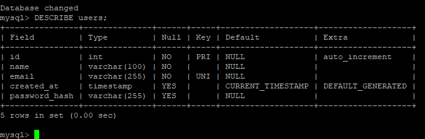

**Почему VARCHAR(255), а не VARCHAR(60)? Что бы произошло если сделать VARCHAR(50)?**  
Алгоритм bcrypt генерирует хеш фиксированной длины — 60 символов. Однако стандарт рекомендует использовать `VARCHAR(255)`, чтобы оставить запас на будущие алгоритмы (например, Argon2 может давать более длинные хеши). Если указать `VARCHAR(50)`, хеш будет **обрезан**, и проверка пароля всегда будет проваливаться.

---

### Задание 2. Partials

Создан файл `partials/nav.php`, который отображает разное меню в зависимости от наличия `$_SESSION['user_id']`.

**Почему меню вынесено в отдельный файл? Что изменится если добавить новую ссылку?**  
Вынесение в partial исключает дублирование кода — меню используется на всех страницах. При добавлении новой ссылки (например, «Избранное») достаточно изменить **один файл**, и изменения применятся на всём сайте.

---

### Задание 3. Вёрстка форм по макетам

Сверстаны формы регистрации (`register.php`) и входа (`login.php`) в соответствии с макетами.

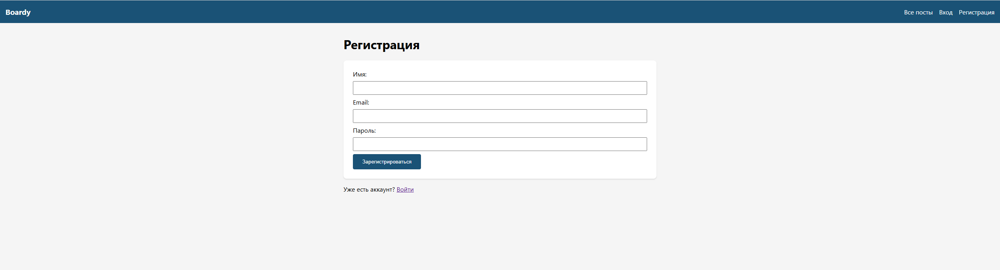

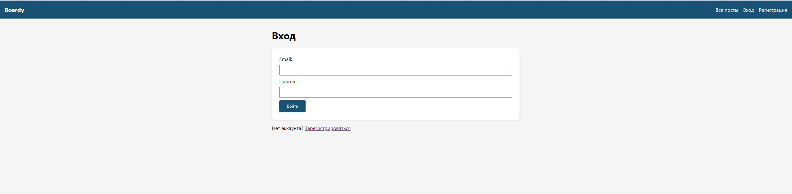

---

## Часть B. Регистрация и логин

### Задание 4. Регистрация

Реализована обработка формы регистрации с автологином и редиректом на `messages.php`.

---

### Задание 5. Хеш в базе

В базе данных хранится хеш в формате bcrypt.

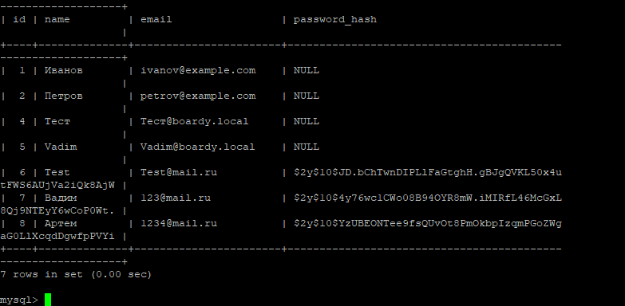

**Объясните структуру хеша `$2y$10$Kx8QnZq...`**  
- `$2y$` — идентификатор алгоритма (bcrypt, совместимый с PHP)
- `10` — cost factor (степень сложности, 2^10 итераций)
- `Kx8QnZq...` — соль + хеш (всего 53 символа после `$`)

**Что произойдёт если cost увеличить с 10 до 15?**  
Время хеширования возрастёт в **32 раза** (2^15 / 2^10 = 32). Это повысит защиту от брутфорса, но замедлит регистрацию и вход.

---

### Задание 6. Защита от повторной регистрации

Реализована проверка уникальности email перед вставкой.

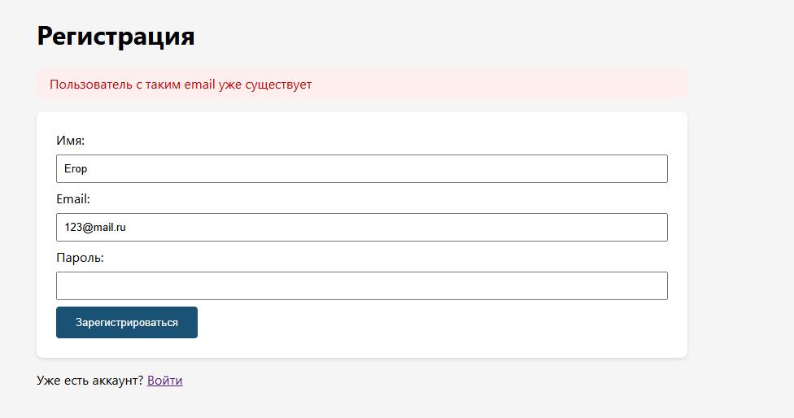

**Зачем проверять email перед INSERT? Что произойдёт без этой проверки?**  
Без проверки при попытке регистрации с существующим email возникнет **ошибка дубликата** (если есть UNIQUE-ограничение) или молчаливое игнорирование. Проверка позволяет показать пользователю понятное сообщение об ошибке.

---

### Задание 7. Логин

Реализована обработка формы входа с установкой сессии.

---

### Задание 8. Неверный пароль

При неверном пароле показывается нейтральное сообщение об ошибке.

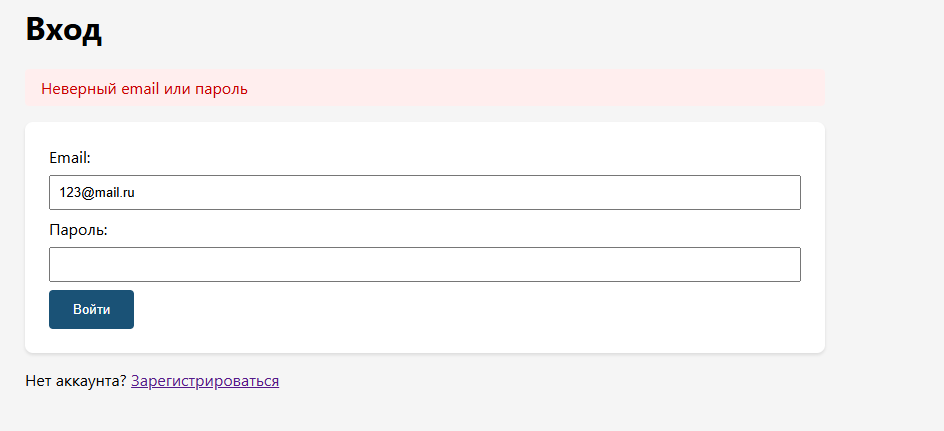

**Почему сообщение одинаковое и для "email не найден", и для "неверный пароль"?**  
Это мера защиты от перебора email-адресов. Если сообщения различались, злоумышленник мог бы определить, какие email зарегистрированы в системе.

---

## Часть C. Куки и сессии

### Задание 9. Кука PHPSESSID

После логина в браузере появляется кука `PHPSESSID`.

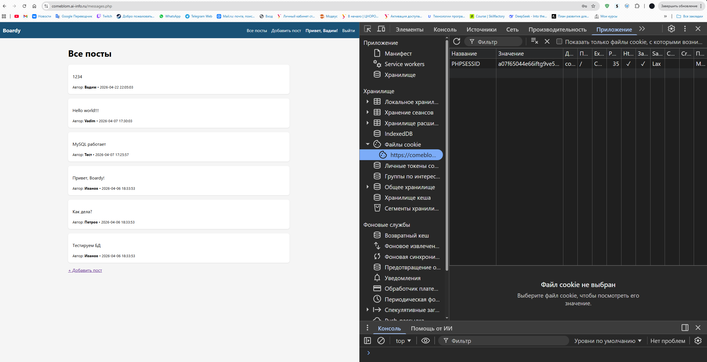

**Что хранится в значении куки? Откуда берётся значение?**  
В значении куки хранится **идентификатор сессии** — случайная строка (например, `a1b2c3d4`). Это **не** пароль и не имя пользователя. Значение генерируется сервером при вызове `session_start()`.

---

### Задание 10. Параметры куки

Настроены безопасные параметры куки: `HttpOnly`, `Secure`, `SameSite=Lax`.

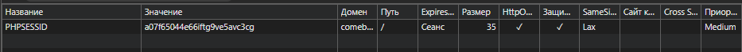

**Что изменится если убрать HttpOnly? Как это можно использовать в XSS-атаке?**  
Без `HttpOnly` JavaScript сможет прочитать `document.cookie` и украсть идентификатор сессии. При XSS-уязвимости атакующий отправит этот ID себе и получит доступ к аккаунту жертвы.

---

### Задание 11. HttpOnly на практике

Кука `PHPSESSID` недоступна через JavaScript.

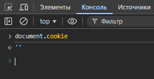

**Почему PHPSESSID не видна JavaScript, хотя кука существует?**  
Атрибут `HttpOnly` запрещает доступ к куке из клиентского JavaScript. Кука отправляется только в HTTP-заголовках, что защищает от кражи при XSS.

---

### Задание 12. Файл сессии на сервере

Данные сессии хранятся на сервере в файле.

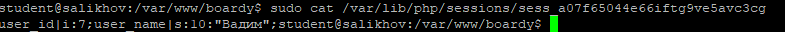

**Что хранится в файле на сервере? Сравните с тем, что в куке. Почему данные разделены так?**  
В файле хранятся **реальные данные сессии**: `user_id|i:5;user_name|s:6:"Ivanov";`.  
В куке — только **идентификатор** этого файла. Такое разделение обеспечивает безопасность: чувствительные данные не покидают сервер.

---

## Часть D. Защита и доработка

### Задание 13. Защита страниц

Страница `submit.php` защищена проверкой авторизации.

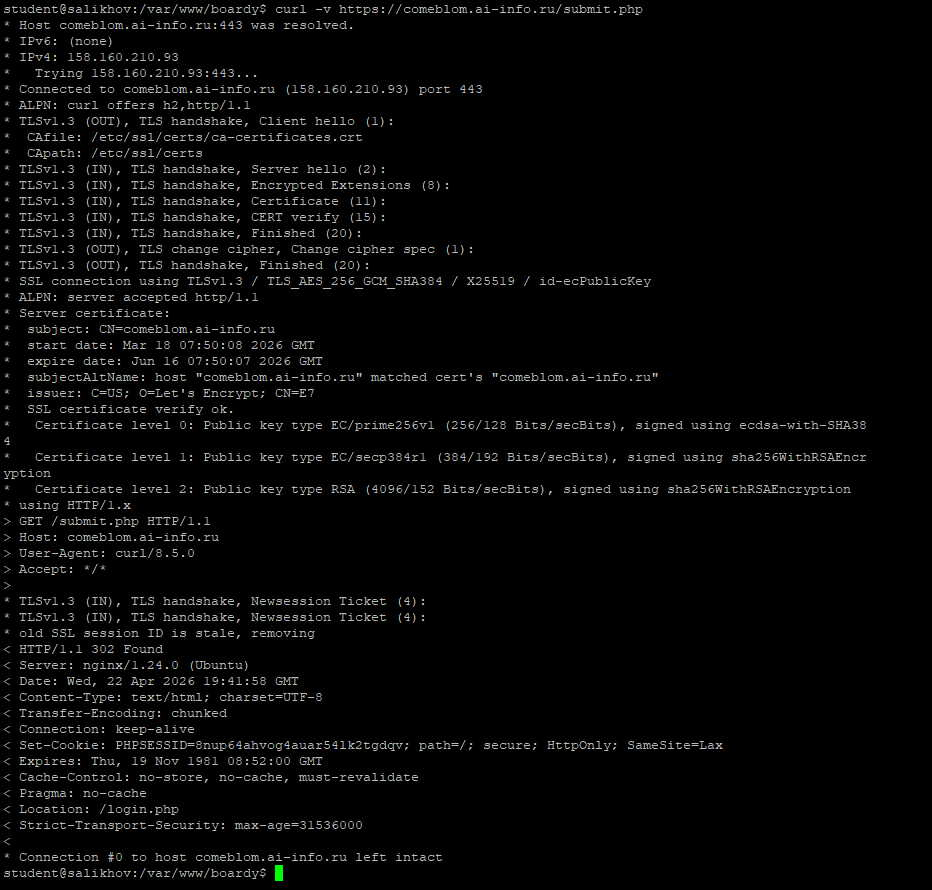

---

### Задание 14. Посты с автором

Реализован вывод постов с именами авторов через JOIN.

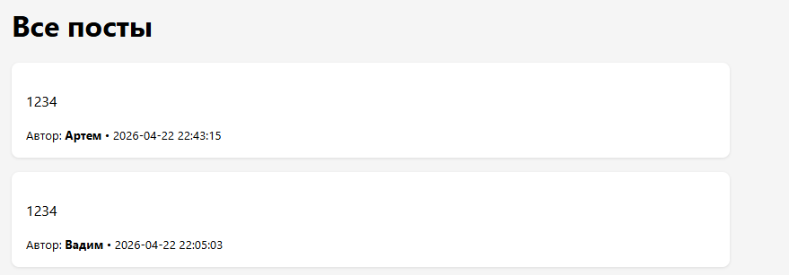

**Напишите SQL с JOIN. Почему JOIN, а не два отдельных запроса?**  
SELECT posts.*, users.name AS author_name
FROM posts
JOIN users ON posts.author_id = users.id;

---

### Задание 15. Добавление поста

Сверстана форма добавления поста по макету.

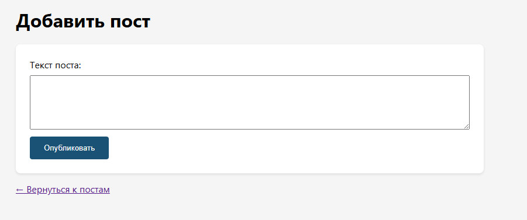

---

### Задание 16. Logout

Реализована функция выхода из системы.

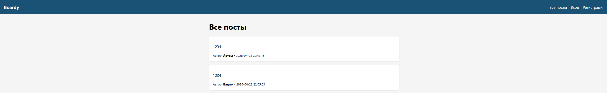

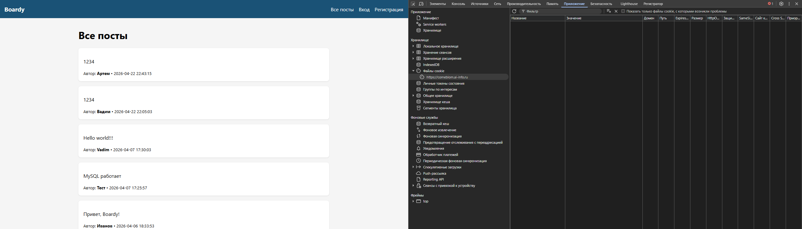

**Что делает session_destroy()? Зачем ещё и setcookie() с прошедшей датой? Что останется если сделать только одно из двух?**  
- `session_destroy()` удаляет **файл сессии на сервере**.  
- `setcookie(..., time()-3600)` удаляет **куку в браузере**.  

Если сделать только `session_destroy()`, кука останется в браузере, и при следующем `session_start()` создастся новая сессия с тем же ID (потенциально опасно).  
Если только удалить куку — файл сессии останется на сервере (утечка памяти).

---

### Задание 17. Истёкшая сессия

При ручном удалении файла сессии сервер больше не распознаёт пользователя.

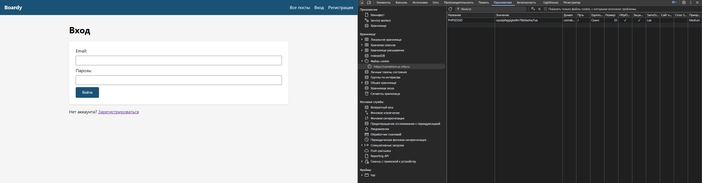

**Почему браузер считает себя залогиненным (есть кука), а сервер — нет?**  
Браузер хранит **идентификатор сессии** (в куке), но сервер не находит соответствующий файл с данными. Без данных на сервере невозможно подтвердить авторизацию, поэтому происходит редирект на логин.