# Лабораторная работа №11: JWT и OAuth

**Студент:** Салихов Вадим 
**Дата выполнения:** 29.04.2026

---

## Часть A. JWT для API

### Задание 1. auth.py

Создан файл `auth.py` с функцией `get_current_user`. Сервер FastAPI перезапущен.

**Что означает «Bearer» в заголовке Authorization? Почему не просто «Authorization: eyJ...»?**  
`Bearer` — это схема аутентификации по стандарту RFC 6750. Она указывает серверу, что следующий токен — это bearer token (доступ предоставляется любому, кто его предъявит). Без указания схемы сервер не сможет корректно обработать заголовок, особенно если поддерживаются несколько схем (например, Basic, Digest).

---

### Задание 2. /api/me.php

Создан скрипт `api/me.php`, который возвращает JWT на основе PHP-сессии.

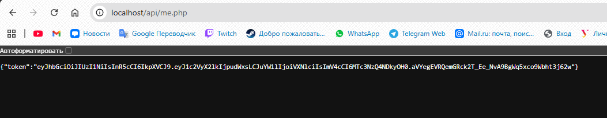

**Почему me.php использует session_start(), а не принимает логин/пароль? Какую роль играет кука PHPSESSID в этом запросе?**  
`me.php` доверяет уже установленной PHP-сессии. Кука `PHPSESSID` автоматически отправляется браузером, и `session_start()` восстанавливает данные сессии (включая `user_id`). Это безопаснее, чем передавать логин/пароль при каждом запросе.

---

### Задание 3. React получает JWT

В компонент `comments.jsx` добавлен `useEffect`, который вызывает `me.php` и сохраняет JWT.

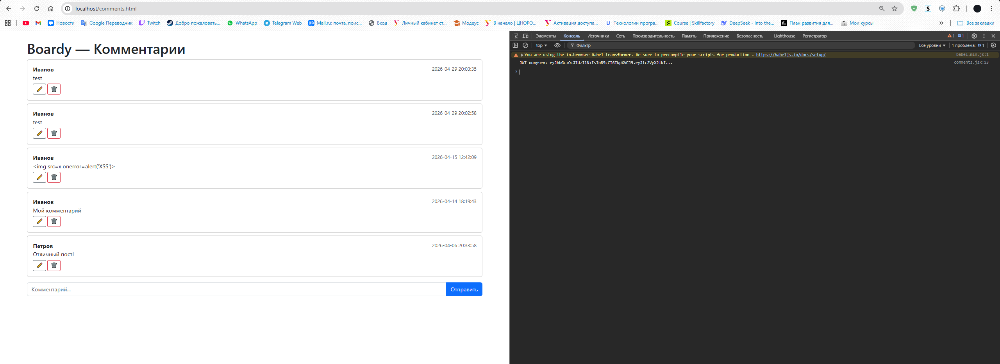

---

### Задание 4. Bearer в запросах

Все запросы из React к FastAPI теперь включают заголовок `Authorization: Bearer <token>`.

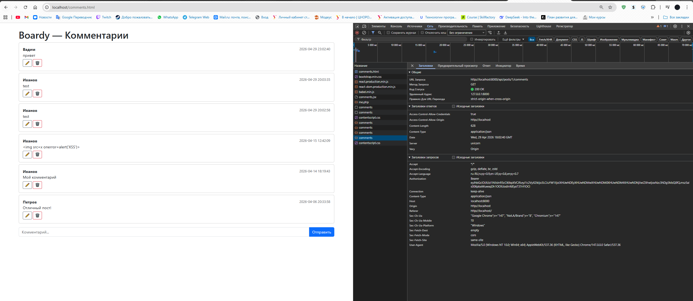

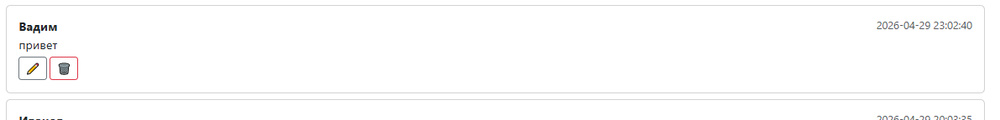

---

### Задание 5. jwt.io

Токен проанализирован на сайте jwt.io.

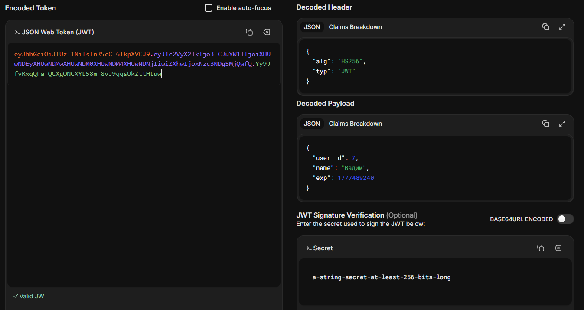

**payload зашифрован или закодирован? Что увидит злоумышленник, перехвативший токен? Почему это не проблема?**  
Payload **закодирован** (base64), но **не зашифрован**. Злоумышленник увидит все данные (user_id, exp и др.). Это не проблема, так как токен подписан секретным ключом — изменить его содержимое невозможно без знания ключа.

---

### Задание 6. Истёкший токен

Токен с `exp = time() + 5` протестирован после истечения срока.

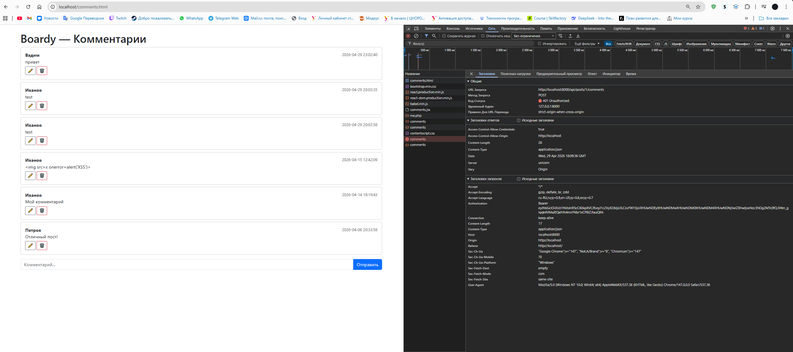

---

### Задание 7. Невалидный токен

Отправлен запрос с некорректным токеном.

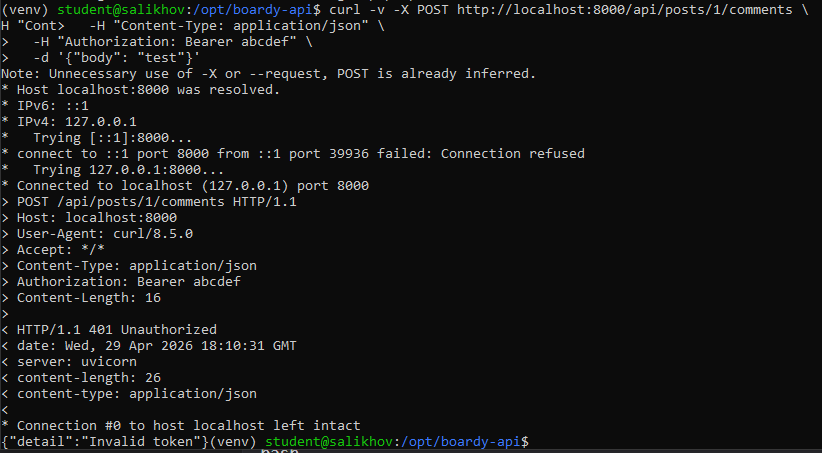

---

## Часть B. OAuth через GitHub

### Задание 8. OAuth App на GitHub

Зарегистрировано OAuth-приложение на GitHub.

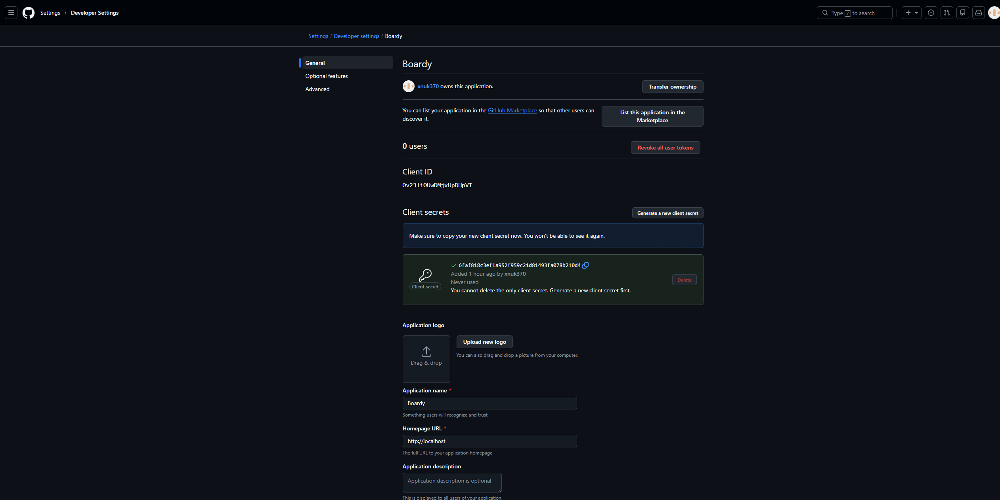

---

### Задание 9. Столбец github_id

Добавлен столбец `github_id` в таблицу `users`.

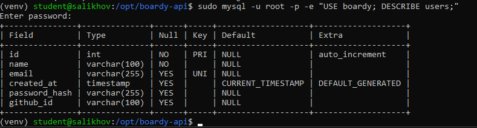

---

### Задание 10. Кнопка «Войти через GitHub»

Добавлена кнопка входа через GitHub.

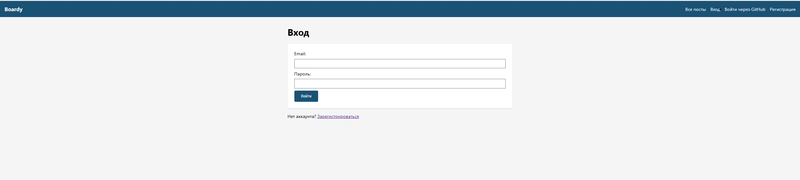

---

### Задание 11. OAuth flow

Пройден полный OAuth-поток через GitHub.

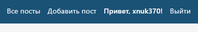

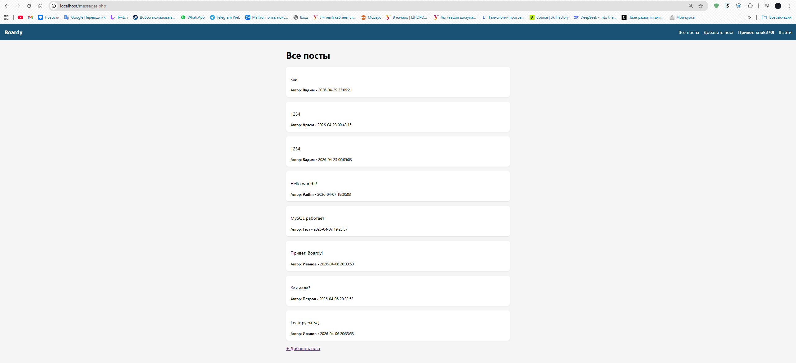

---

### Задание 12. github_id в базе

Пользователь из GitHub сохранён в базе.

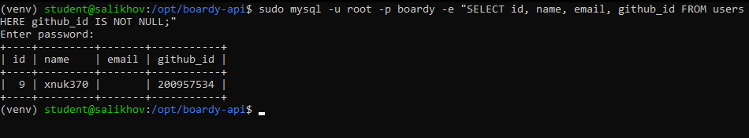

**Почему ищем по github_id, а не по email?**  
Email пользователя на GitHub может быть скрыт или изменён. `github_id` — это уникальный и неизменяемый идентификатор, гарантирующий надёжную привязку аккаунта.

---

### Задание 13. OAuth → JWT → API

После входа через GitHub создан комментарий через React и FastAPI.

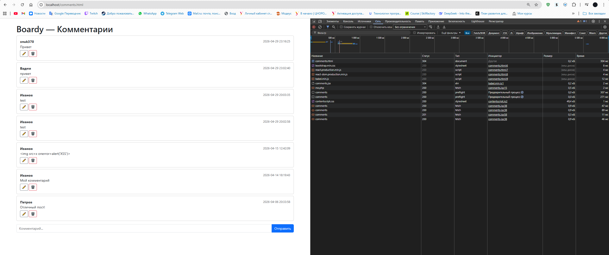

**Flow:**  
1. Пользователь кликает «Войти через GitHub»  
2. Редирект на GitHub → авторизация  
3. GitHub редиректит обратно с code  
4. Backend обменивает code на access_token, получает данные пользователя  
5. Создаётся/находится запись в БД по github_id, устанавливается PHP-сессия  
6. React запрашивает `/api/me.php` → получает JWT  
7. React отправляет комментарий в FastAPI с JWT  
8. FastAPI проверяет JWT, создаёт комментарий от имени пользователя

---

### Задание 14. Параметр state

**Что такое state в OAuth? Опишите сценарий CSRF-атаки без state:**  
`state` — случайная строка, генерируемая клиентом и передаваемая в GitHub. После редиректа она должна совпасть.  
**Сценарий атаки без state:**  
1. Жертва заходит на сайт злоумышленника  
2. Сайт редиректит жертву на OAuth GitHub с redirect_uri на атакующий сервер  
3. Жертва авторизуется в GitHub  
4. GitHub редиректит жертву с code на сервер злоумышленника  
5. Злоумышленник использует code для получения доступа к аккаунту жертвы

---

## Часть C. Анализ

### Задание 15. Три способа входа

Работают все три метода аутентификации.

---

### Задание 16. Сравнение механизмов

| Вопрос                      | Куки+сессии           | JWT                   | OAuth                 |
|-----------------------------|-----------------------|-----------------------|-----------------------|
| Где хранятся данные?        | На сервере (файл/БД)  | В самом токене        | У провайдера (GitHub) |
| Кто прикрепляет к запросу?  | Браузер (автоматом)   | Клиент (вручную)      | Клиент (после flow)   |
| Для какого типа клиентов?   | Web-браузеры          | Любые (Web, Mobile)   | Любые                 |
| Можно ли отозвать?          | Да (удалить сессию)   | Только через expiry   | Через провайдера      |
| Кросс-доменно работает?     | Нет (SameSite)        | Да                    | Да                    |

---

### Задание 17. Баги и пакеты

**3 бага и их решения в Laravel:**

1. **Баг:** Отсутствие валидации входных данных в формах.  
   **Опасность:** XSS, SQL-инъекции.  
   **Пакет:** Laravel Validation + Eloquent ORM (prepared statements).

2. **Баг:** Нет CSRF-защиты для POST-форм.  
   **Опасность:** Подделка запросов от имени пользователя.  
   **Пакет:** Встроенный middleware `VerifyCsrfToken`.

3. **Баг:** Ручная генерация JWT без учёта лучших практик.  
   **Опасность:** Уязвимости в подписи, неправильный expiry.  
   **Пакет:** `tymon/jwt-auth` — готовая, протестированная реализация.