# Отчёт по лабораторной работе №15
**Тема:**  Docker 

**Выполнил:** Салихов Вадим  
**Дата:** 03.06.2026

---

## 1. Цель работы
Упаковать многокомпонентное веб-приложение (Laravel Backend, FastAPI Microservice, Nginx Reverse Proxy, MySQL, Redis) в контейнеры Docker. Настроить их взаимодействие через общую сеть, обеспечить сохранность данных с помощью volumes и настроить автоматические проверки здоровья (healthchecks).

## 2. Реализация (Архитектура)

Проект состоит из 5 сервисов, описанных в `docker-compose.yml`:
1.  **Laravel (PHP 8.3)** — основное веб-приложение.
2.  **FastAPI (Python 3.11)** — микросервис для работы с WebSocket и асинхронными задачами.
3.  **Nginx** — прокси-сервер для маршрутизации запросов и работы с SSL/WS.
4.  **MySQL** — основная база данных.
5.  **Redis** — кэширование и брокер сообщений.

### Часть А. Настройка Laravel
Использован образ `php:8.3-fpm`. Установлены необходимые расширения (`pdo_mysql`, `redis` через pecl).
*Для кеширования зависимостей Composer слои Dockerfile разделены: сначала копируются `composer.json`/`.lock`, затем выполняется установка, и только потом копируется весь код проекта.*

### Часть Б. Настройка FastAPI
Использован образ `python:3.11-slim`. Зависимости зафиксированы в `requirements.txt` (fastapi, uvicorn, aiomysql, redis).
*Сервер Uvicorn запускается с флагом `--host 0.0.0.0` для приема подключений извне контейнера.*

### Часть В. Nginx и Сеть
Nginx настроен как Reverse Proxy.
- Запросы к `/` проксируются на `laravel:9000` (PHP-FPM).
- Запросы к `/ws` и `/api` проксируются на `fastapi:8000`.
- Настроены заголовки `Upgrade` и `Connection` для поддержки WebSocket.

---

## 3. Ответы на теоретические вопросы

### 3.1 PHP-FPM vs Apache+PHP
**Вопрос:** Зачем PHP-FPM в Docker, а не Apache+PHP?
**Ответ:** Использование PHP-FPM позволяет разделить ответственность: Nginx занимается отдачей статики, SSL и балансировкой, а PHP-FPM — только исполнением скриптов. Это архитектурно чище и позволяет масштабировать PHP-воркеры отдельно от веб-сервера.

### 3.2 Кеширование слоёв Docker
**Вопрос:** Что произойдёт если COPY всего проекта сделать ДО composer install?
**Ответ:** Docker кеширует слои на основе изменений в файлах. Если `COPY . .` стоит раньше `RUN composer install`, то любое изменение в коде (даже комментарий) сделает кеш невалидным. Composer будет заново скачивать все пакеты при каждой сборке, что сильно замедлит процесс.

### 3.3 Безопасность .dockerignore
**Вопрос:** Что произойдёт если не исключить .env из образа?
**Ответ:** Файл `.env` содержит пароли и секретные ключи. Если он попадёт в образ, любой, у кого есть доступ к образу (например, из Docker Hub), сможет извлечь секреты. `.dockerignore` предотвращает добавление приватных файлов в слои образа.

### 3.4 Фиксация версий Python
**Вопрос:** Почему версии фиксируем, а не пишем 'latest'?
**Ответ:** Тег `latest` подвижен. Пакет, который работал сегодня, может получить обновление с ломающими изменениями (breaking changes) завтра. Фиксация версий (`package==1.0.0`) гарантирует, что приложение будет работать одинаково и через год (reproducibility).

### 3.5 Сетевой интерфейс Uvicorn
**Вопрос:** Почему --host 0.0.0.0, а не 127.0.0.1?
**Ответ:** `127.0.0.1` (localhost) доступен только внутри самого контейнера. Чтобы другие контейнеры (например, Nginx) могли подключиться к FastAPI, сервис должен слушать на всех интерфейсах — `0.0.0.0`.

### 3.6 DNS в Docker
**Вопрос:** Почему laravel:9000, а не 127.0.0.1:9000?
**Ответ:** Внутри контейнера Nginx адрес `127.0.0.1` указывает на сам Nginx. Для обращения к Laravel нужно использовать его сетевое имя (`laravel`), которое Docker автоматически резолвит во внутренний IP-адрес контейнера в рамках общей сети `boardy_net`.

### 3.7 Healthchecks и Race Conditions
**Вопрос:** Почему depends_on без healthcheck недостаточно?
**Ответ:** `depends_on` гарантирует только порядок запуска (сначала MySQL, потом Laravel), но не готовность. MySQL может запускаться 10 секунд. Если Laravel стартует мгновенно, он упадет с ошибкой подключения к БД. `healthcheck` (проверка `mysqladmin ping`) заставляет Docker ждать реальной готовности базы.

### 3.8 Volumes и persist data
**Вопрос:** Что произойдёт с данными MySQL если убрать volume и сделать down?
**Ответ:** Данные хранятся внутри файловой системы контейнера. При удалении контейнера (`down`) данные теряются безвозвратно. Именованные volumes (`mysql_data`) живут отдельно от контейнеров и сохраняют данные между перезапусками.

### 3.9 Exec vs Run
**Вопрос:** Чем docker compose exec отличается от docker compose run?
**Ответ:** 
- `exec` выполняет команду в **уже запущенном** контейнере (например, миграции в работающем приложении).
- `run` запускает **новый** временный контейнер, выполняет команду и удаляет его.

---

## 4. Скриншоты и доказательства работы

### 4.1 Сборка и конфигурация

**Скриншот 01: Сборка Laravel**
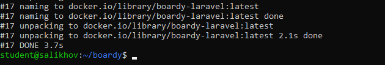
> Успешная сборка образа с расширениями PHP.

**Скриншот 02: Кеширование Composer**
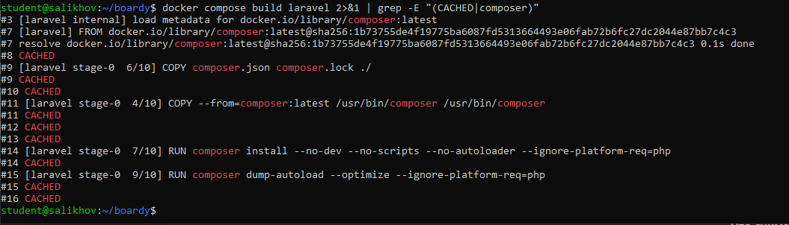
> Видно использование CACHED слоёв при повторной сборке.

**Скриншот 03: Dockerignore**
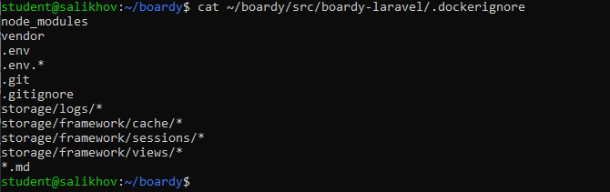
> Файл исключает `node_modules`, `.env` и кеш.

**Скриншот 04: Requirements FastAPI**
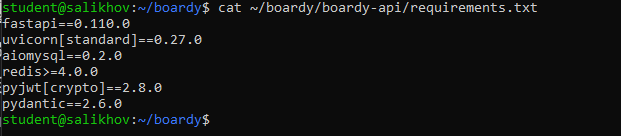
> Фиксированные версии пакетов Python.

**Скриншот 05-08: Конфигурация Nginx и FastAPI**
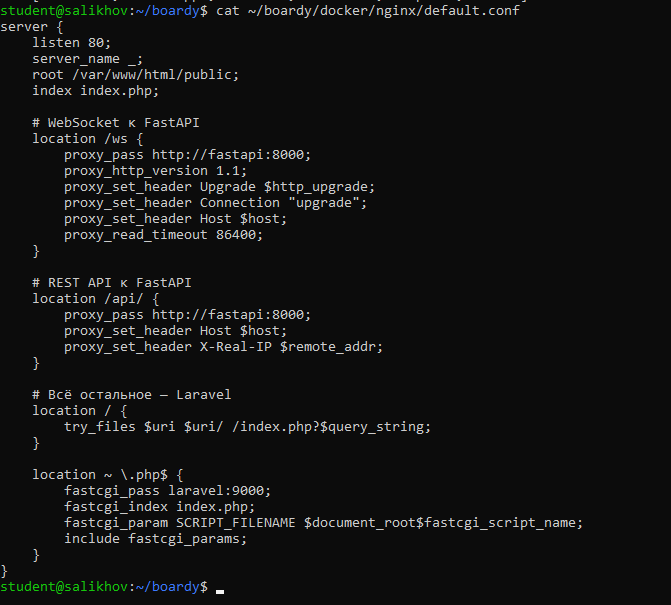
> Конфиг Nginx с проксированием на `laravel:9000` и `fastapi:8000` + настройки WebSocket.

### 4.2 Запуск стека

**Скриншот 09: Docker Compose YML**
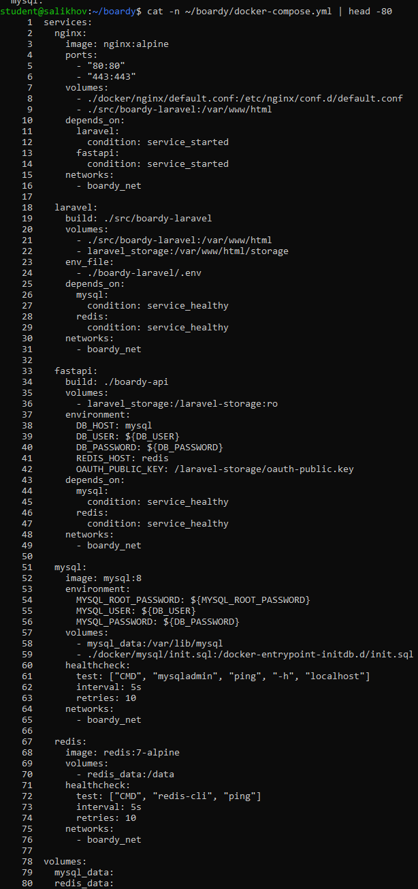
> Описание 5 сервисов в файле конфигурации.

**Скриншот 10: Volumes**
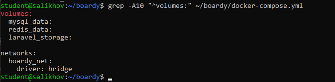
> Настройка именованных томов для данных.

**Скриншот 11: Healthchecks**
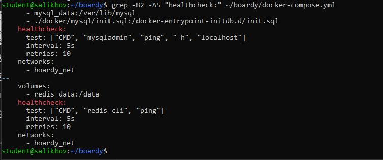
> Настройка проверок здоровья для MySQL и Redis.

**Скриншот 12-13: Инициализация БД**
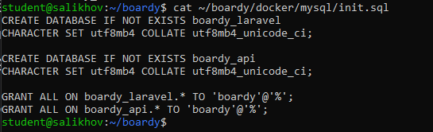
> Скрипт создания двух баз данных (`boardy_laravel` и `boardy_api`).

**Скриншот 14-15: Переменные окружения**
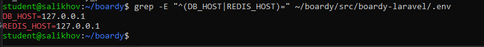
> Настройки `.env` Laravel, указывающие на хосты `mysql` и `redis`.

**Скриншот 16: Статус контейнеров**
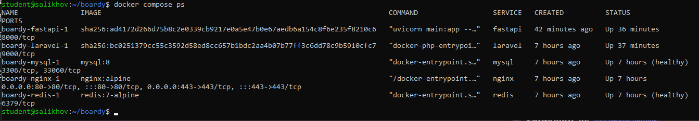
> Все 5 сервисов в статусе `Up`, базы данных `healthy`.

### 4.3 Приложение и Миграции

**Скриншот 17-18: Миграции и Passport**
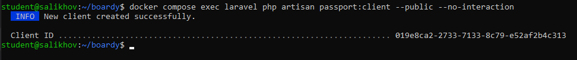
> Успешная генерация OAuth-ключей и создание клиента.

**Скриншот 19-20: Работа приложения**
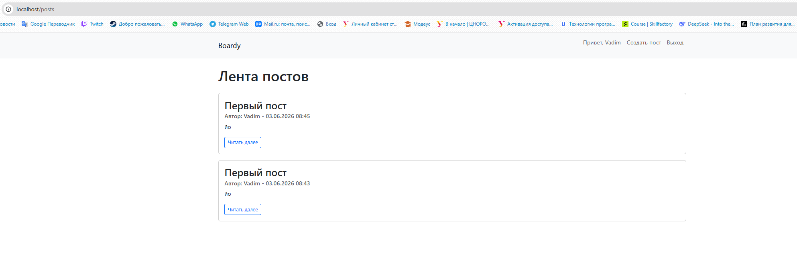
> Главная страница, создание поста и комментариев работает.

**Скриншот 21-22: WebSocket (Realtime)**
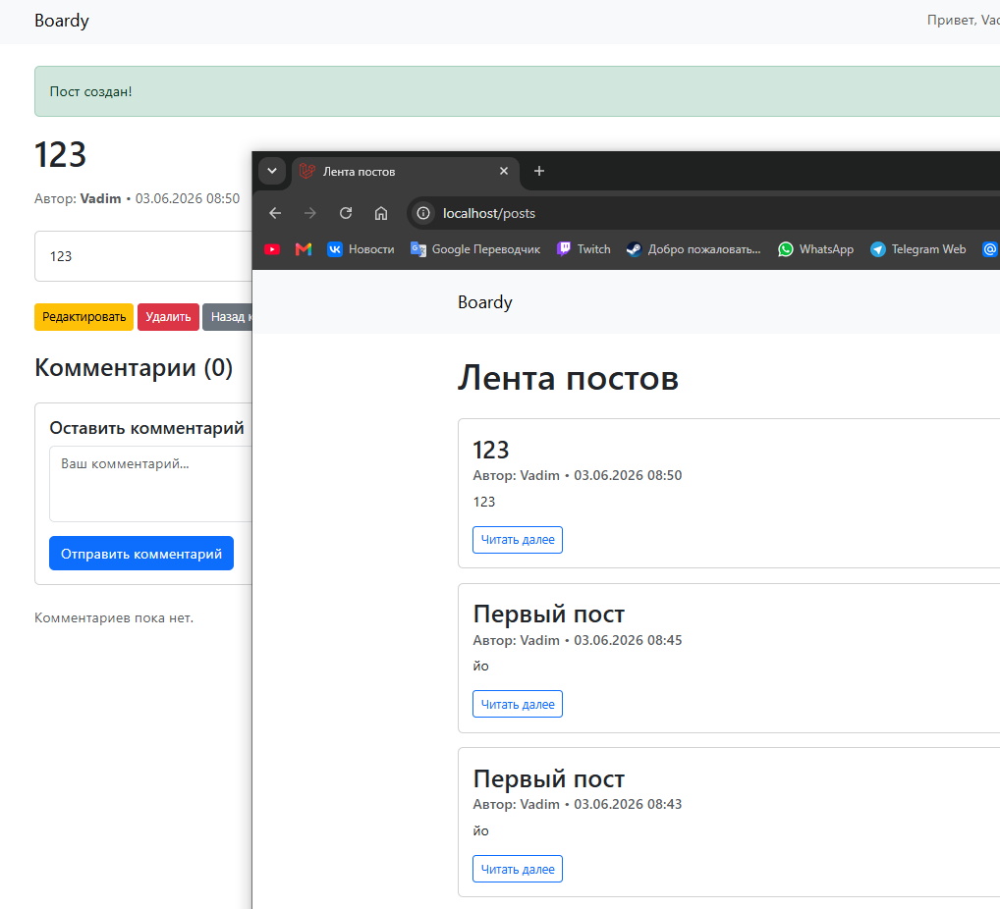
> Пост, созданный в одном окне, мгновенно появляется в другом (WebSocket).

### 4.4 Проверка надежности

**Скриншот 23: Сохранение данных**
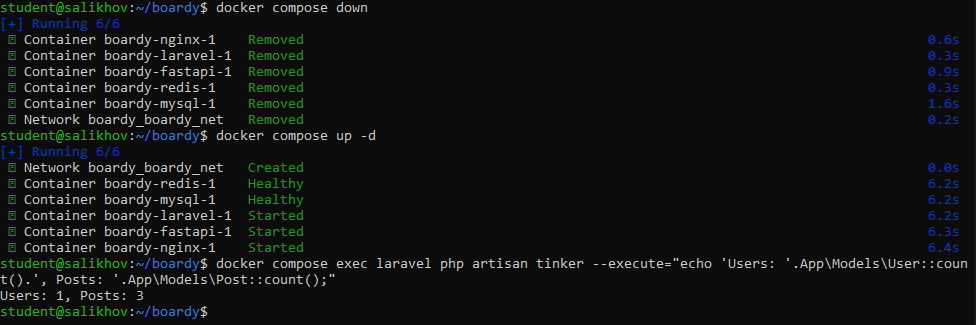
> После `docker compose down && up` данные пользователей и постов на месте.

**Скриншот 24: Логи**
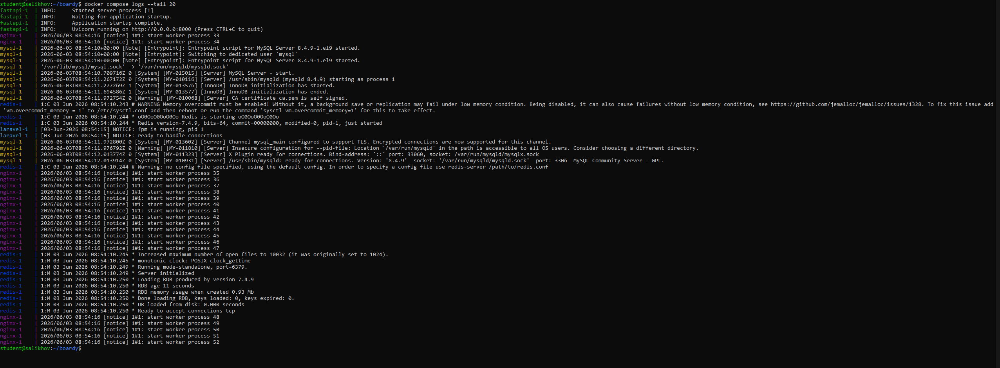
> Централизованный вывод логов всех сервисов.

**Скриншот 25: Чистый запуск**
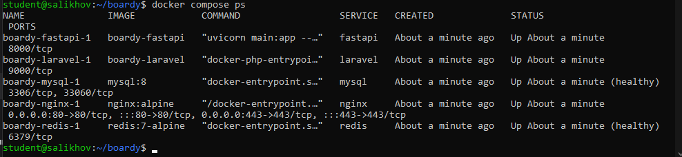
> Проект успешно стартует на чистом окружении.

---

