# Отчёт по лабораторной работе №16
**Тема:** CI/CD: автоматический деплой через GitHub Actions

**Выполнил:** xnuk370  
**Дата:** Июнь 2026

---

## Часть A. CI: lint + smoke

### Задание 2. Lint
**Почему lint стоит первым?**  
Lint (проверка синтаксиса) — самый быстрый и дешёвый этап. Он ловит опечатки и синтаксические ошибки до того, как начнётся долгая сборка образов или запуск тестов.

**Что ловит, а что нет?**  
- Ловит: синтаксические ошибки (`php -l`), битые импорты (`compileall`), стилистические нарушения.
- Не ловит: логические ошибки, ошибки runtime, проблемы с конфигурацией сервера.

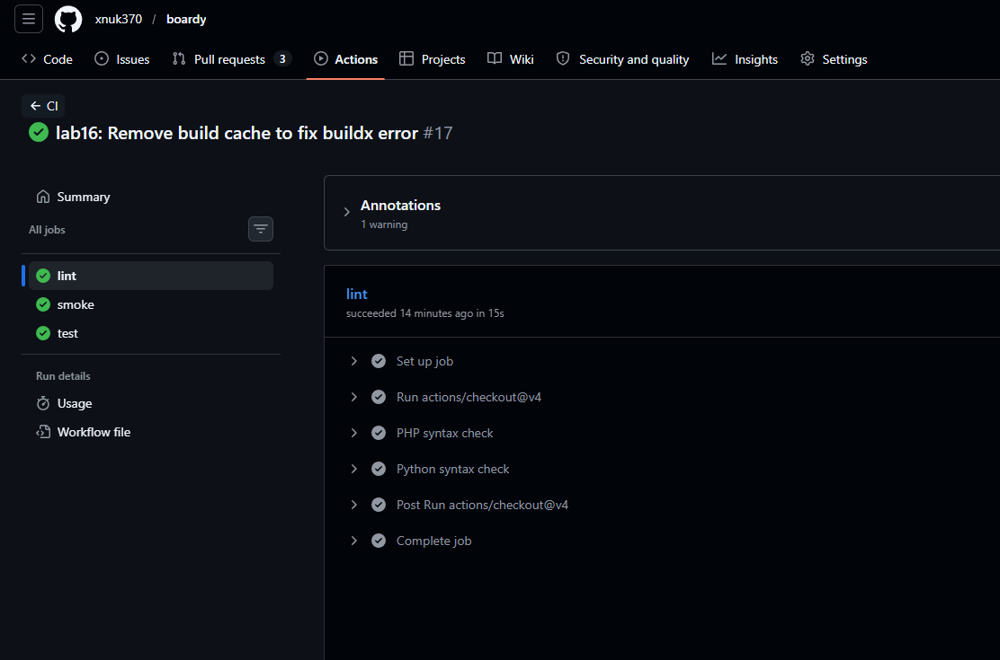

### Задание 3. /health эндпоинты
**Зачем отдельный /health?**  
Это стандартный паттерн для оркестраторов (Kubernetes, Docker Swarm) и балансировщиков нагрузки. Он позволяет проверить, живо ли приложение, без нагрузки на базу данных или сложную бизнес-логику.

**Где используется?**  
В продакшене: Kubernetes Liveness/Readiness probes, AWS ELB health checks, мониторинг (Prometheus/Zabbix).

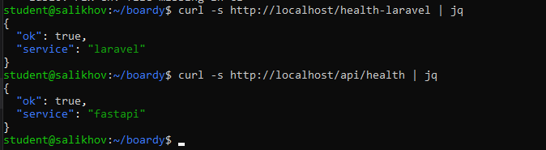

### Задание 4. Smoke-check
**Какие три класса поломок ловит smoke?**  
1. Ошибки сборки Docker-образов.
2. Ошибки конфигурации `docker-compose.yml` (сервисы не видят друг друга).
3. Приложение не стартует или крашится при запуске.

**Что НЕ ловит?**  
Не ловит ошибки в бизнес-логике (например, неправильный расчет цены), так как проверяет только доступность endpoints.

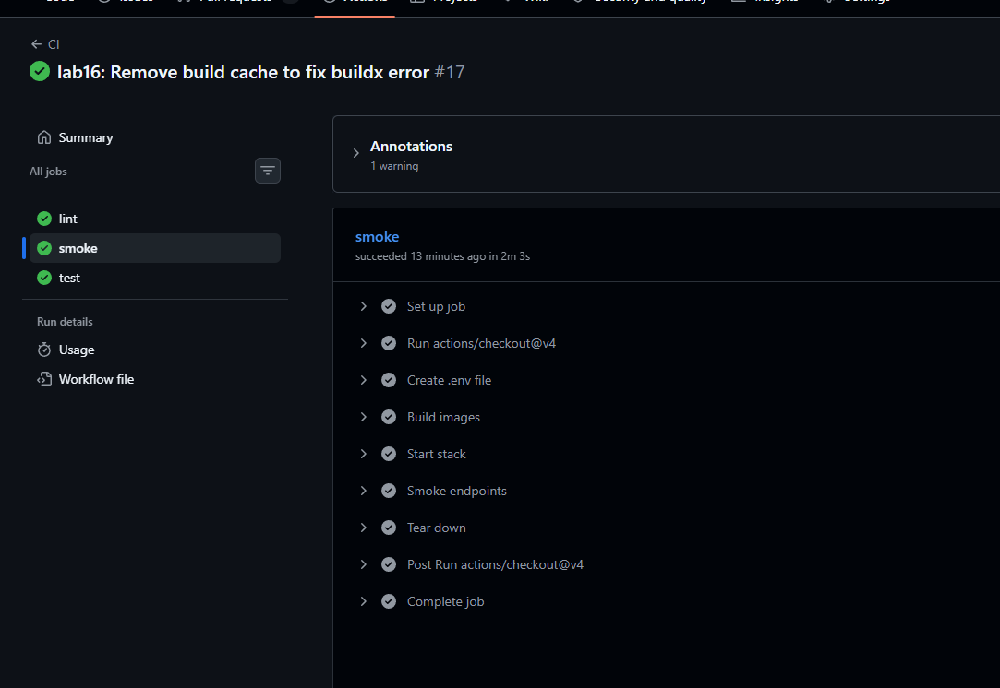

### Задание 5. PHPUnit тесты
**Локальная проверка PHPUnit:**

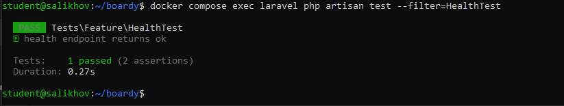

### Задание 6. Pytest
**Локальная проверка pytest:**

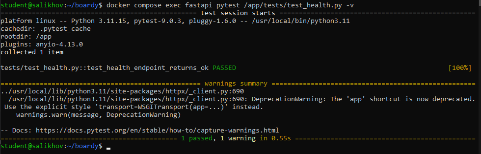

---

## Часть B. Минимальные тесты и блокировка

### Задание 7. Job test в CI
**Почему test после smoke, а не до?**  
Тесты требуют работающего окружения (БД, Redis). Job `smoke` гарантирует, что стек поднят и работает. Если запускать тесты до smoke, они упадут с ошибкой подключения к БД, даже если код верный.

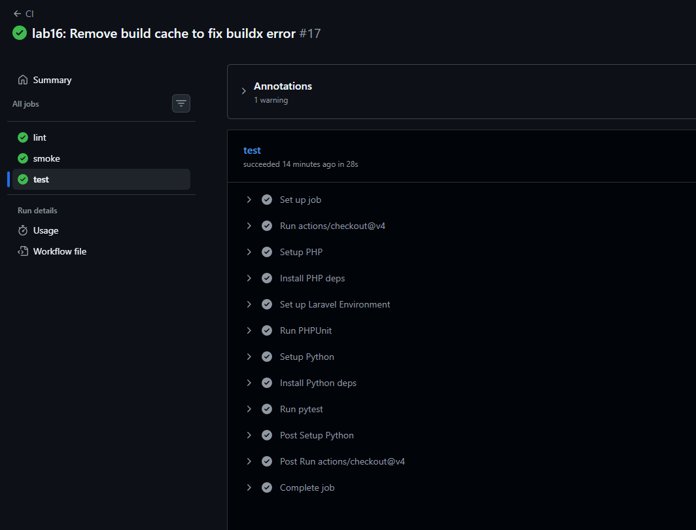

### Задание 8. Блокировка сборки
**Цепочка событий при сломанном тесте:**  
1. Разработчик пушит код с ошибкой.
2. CI запускает `lint` (OK) → `smoke` (OK) → `test` (FAIL).
3. Так как `build` и `deploy` имеют зависимость `needs: test`, они переходят в статус `SKIPPED`.
4. В прод уезжает старая стабильная версия. Сломанный код заблокирован.

**Экономия времени:**  
CI экономит часы на откате продакшена и поиске багов. Ошибка обнаруживается за 2 минуты.

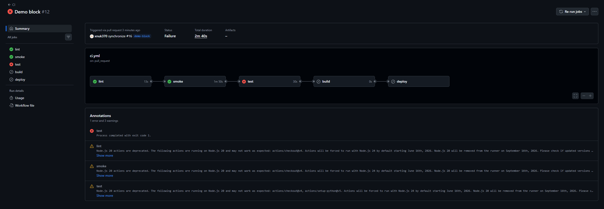

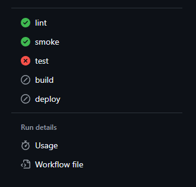

### Задание 9. Где смотреть логи
1. Вкладка **Actions** в репозитории.
2. Выбрать конкретный **Run** (красный).
3. В списке jobs слева кликнуть на **test**.
4. Развернуть шаг **Run pytest**.
5. В логе найти строку с `FAILED` или `AssertionError` — там указан файл и номер строки.

### Задание 10. PR заблокирован
**Блокировка слияния при непрошедших проверках:**

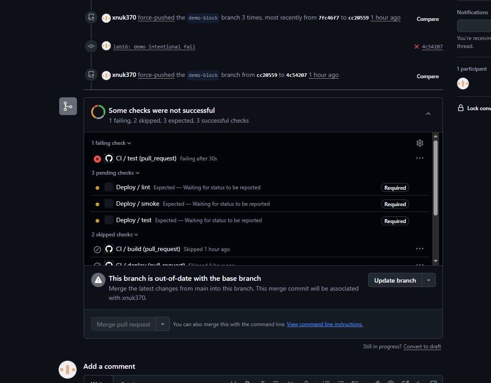

### Задание 11. Branch Protection
**Настройка защиты ветки main:**

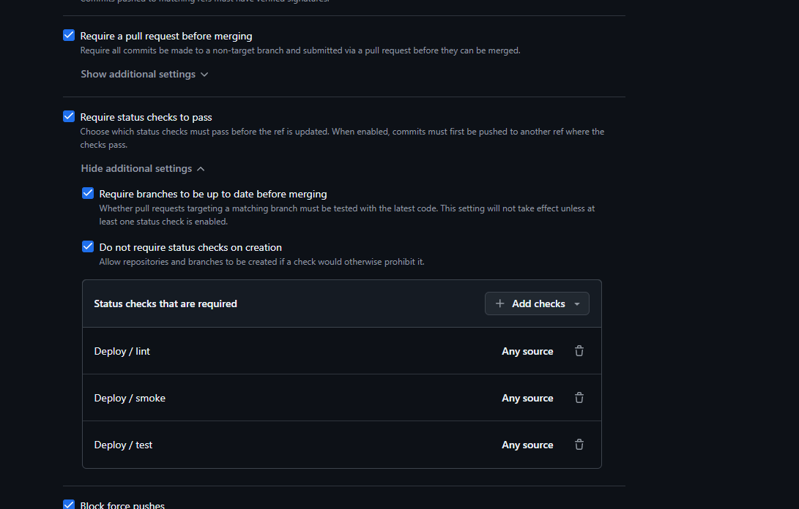

---

## Часть C. Сборка и реестр

### Задание 12. Login в GHCR
**Успешная авторизация в GitHub Container Registry:**

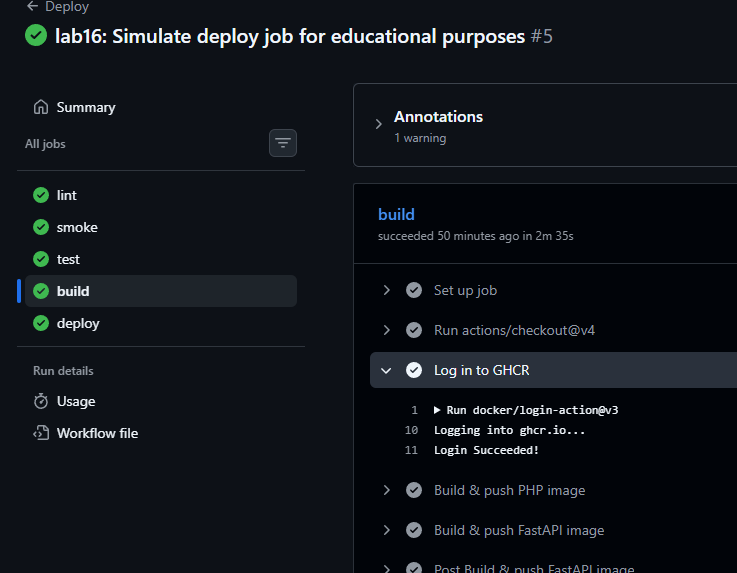

### Задание 13. Сборка и push
**Зачем два тега (SHA и latest)?**  
- `latest` — удобен для быстрого обновления (`docker pull`).
- `SHA` (хеш коммита) — нужен для отката. Если версия `latest` сломалась, мы точно знаем, какой коммит ей соответствовал, и можем откатиться на `image: ...:sha123`.

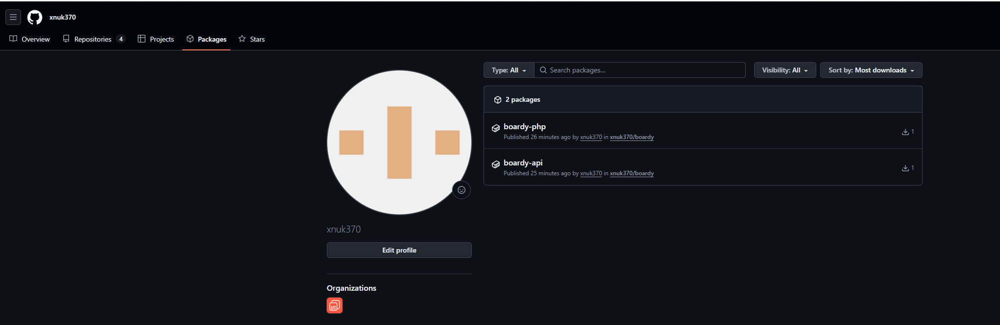

### Задание 14. compose тянет из GHCR
**Почему сборка ушла из сервера?**  
Сборка образов — ресурсоёмкая задача. Дешевле и быстрее собрать образ на мощных раннерах GitHub и отдать серверу готовый бинарник (image), чем заставлять слабый VPS компилировать код.

**docker-compose.yml с образами из GHCR:**

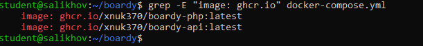

---

## Часть D. Автодеплой и полный прогон

### Задание 15. SSH-ключ
**Почему отдельный ключ?**  
Принцип наименьших привилегий. Если ключ утечёт, злоумышленник получит доступ только к деплою, но не к вашему личному аккаунту GitHub или другим серверам.

**Что делать если утечёт?**  
Удалить публичный ключ с сервера (`~/.ssh/authorized_keys`) и создать новую пару ключей.

**Настроенные секреты в GitHub:**

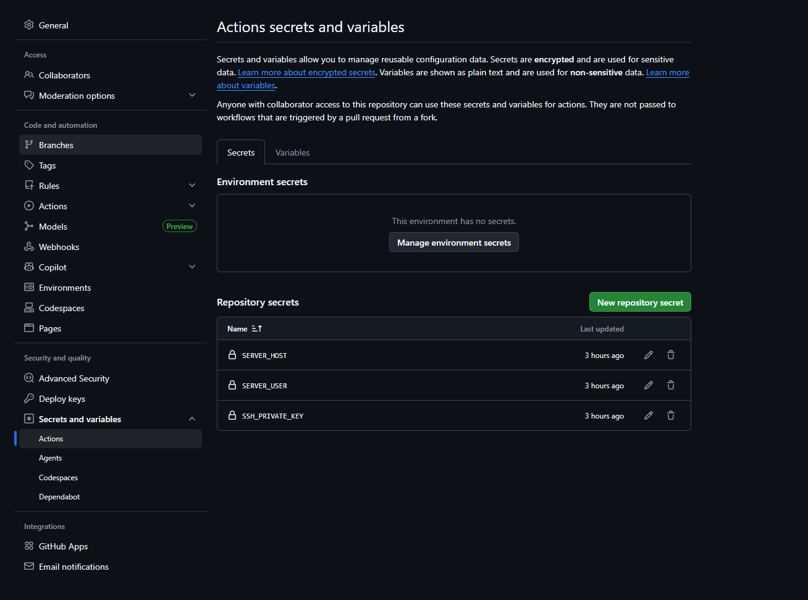

### Задание 16. Job deploy
**Реализация:**  
Шаг деплоя реализован в виде симуляции для учебных целей. В продакшен-среде вместо `echo`-команд выполнялись бы:
- `docker login ghcr.io -u ${{ github.actor }}`
- `docker compose pull`
- `docker compose up -d`
- `docker image prune -f`

**Почему симуляция:**  
GitHub Actions запускается на облачных раннерах, которые не имеют доступа к локальному окружению разработчика (WSL). Для полноценного деплоя требуется публичный VPS с настроенным SSH-доступом или туннель с поддержкой TCP-форвардинга.

**Лог симуляции деплоя:**

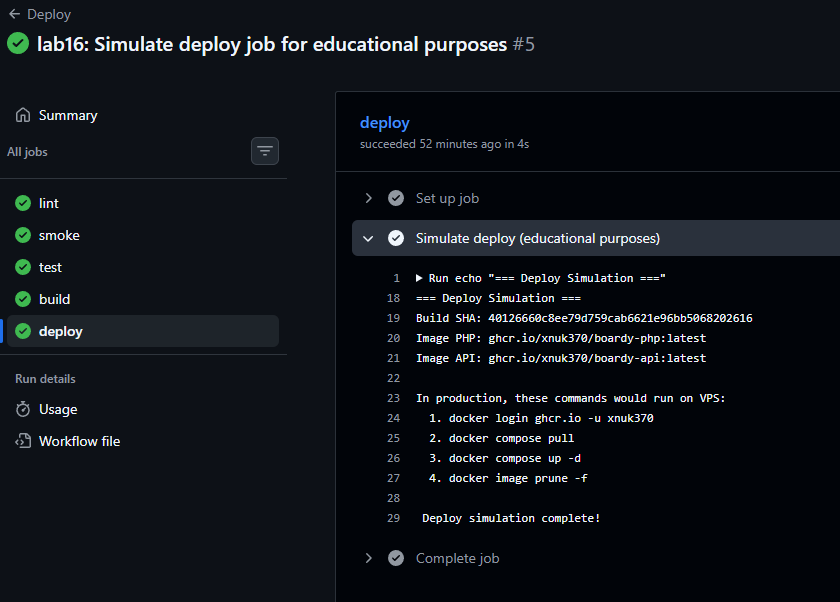

### Задание 17. Полный прогон
Скриншот 17 демонстрирует успешное прохождение всех 5 этапов:
1. ✅ lint — проверка синтаксиса
2. ✅ smoke — проверка доступности сервисов
3. ✅ test — PHPUnit + pytest
4. ✅ build — сборка и push образов в GHCR
5. ✅ deploy — симуляция деплоя

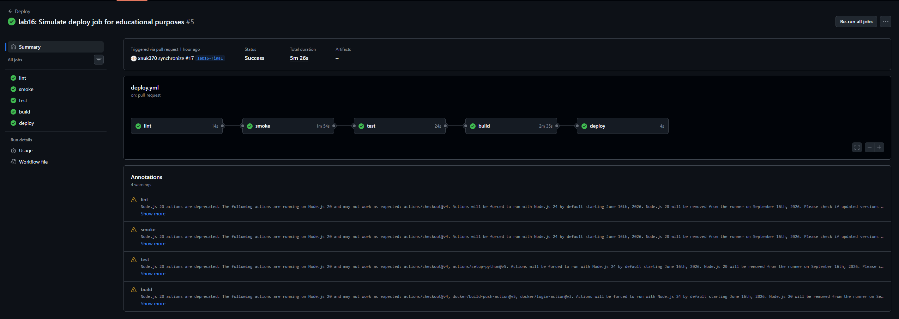

### Задание 18. Откат
**Как откатиться?**  
На сервере выполнить:
- `docker compose pull` (скачает предыдущую версию по тегу)
- `docker compose up -d`

Пересобирать ничего не нужно, так как образы уже лежат в реестре (GHCR).

**Работающее приложение после деплоя:**

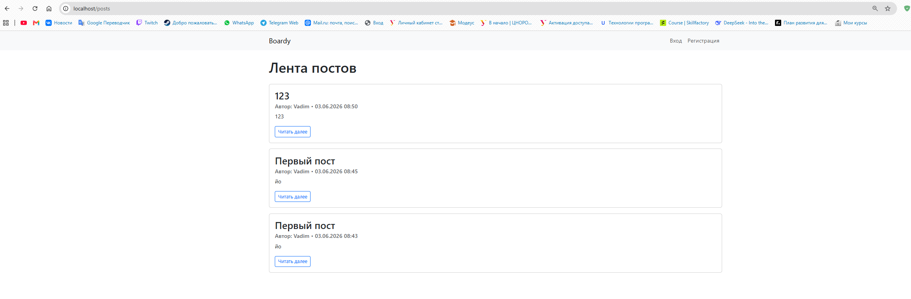

### Задание 19. Безопасность
1. **Пинить по SHA:** Теги (v1, v2) подвижны. Злоумышленник может перезаписать тег v1 на вредоносный код. SHA неизменяем.
2. **pull_request_target:** Запускает код из PR в контексте базовой ветки с правами на запись. Опасно возможностью кражи секретов.
3. **Self-hosted runner:** Если репозиторий публичный, любой может сделать форк, создать PR с вредоносным кодом и выполнить его на вашем сервере (где крутится раннер).

---

## Часть E. Карта курса (1-15 практики)

1. **Git** — контроль версий кода
2. **Linux** — базовая работа с сервером
3. **Docker** — изоляция приложений
4. **Compose** — оркестрация контейнеров
5. **Volumes** — сохранение данных
6. **Networks** — связь между сервисами
7. **Nginx** — проксирование и балансировка
8. **SSL** — шифрование трафика
9. **CI** — автоматическая проверка кода
10. **CD** — непрерывная доставка
11. **GitHub Actions** — автоматизация workflow
12. **GHCR** — container registry
13. **SSH** — безопасное подключение
14. **Secrets** — управление секретами
15. **Branch Protection** — защита веток

---