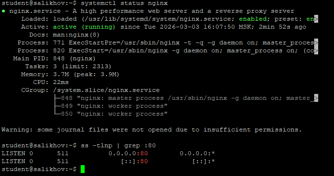
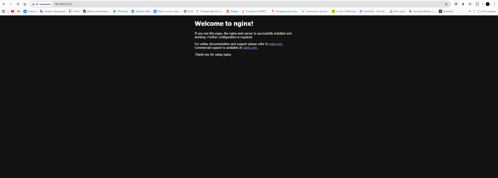
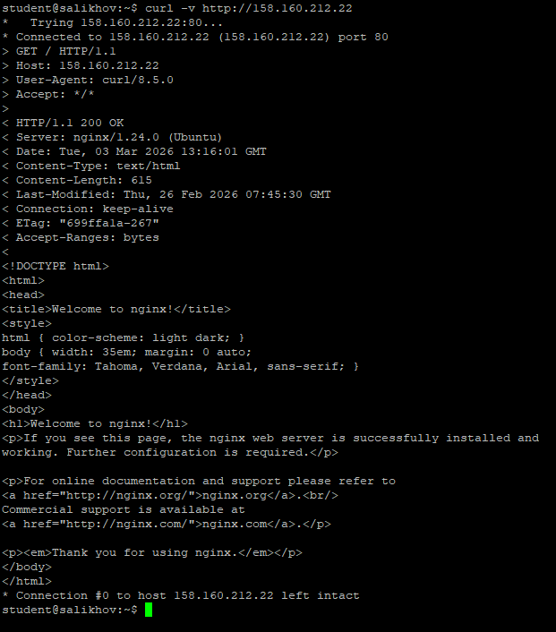
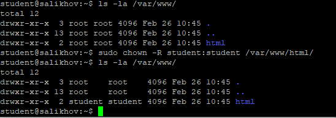
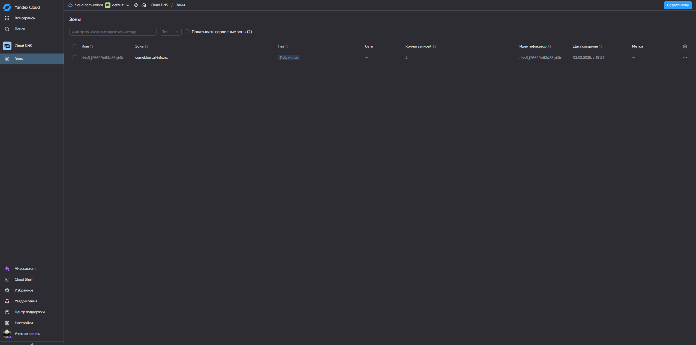
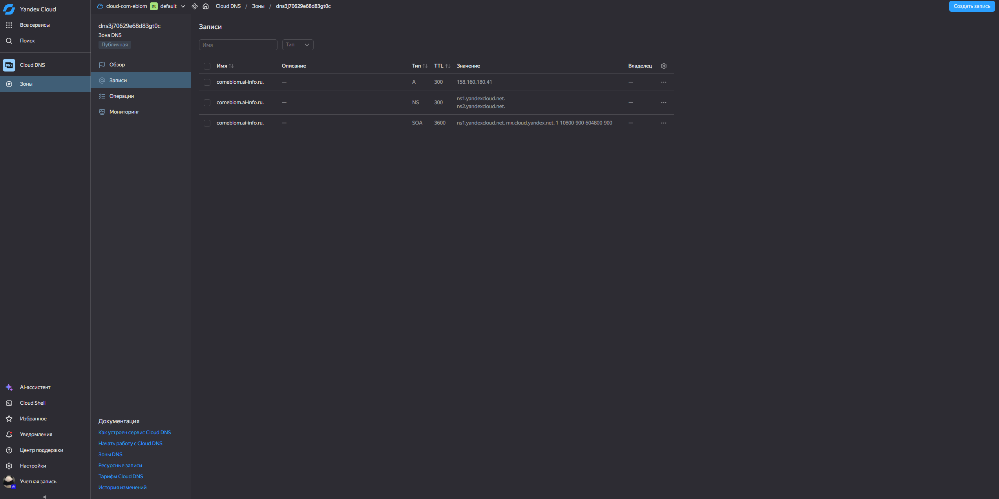
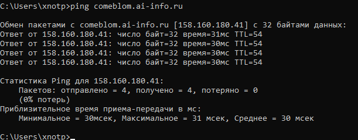
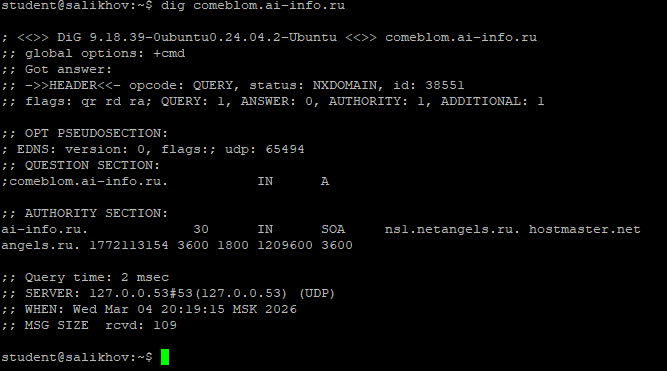
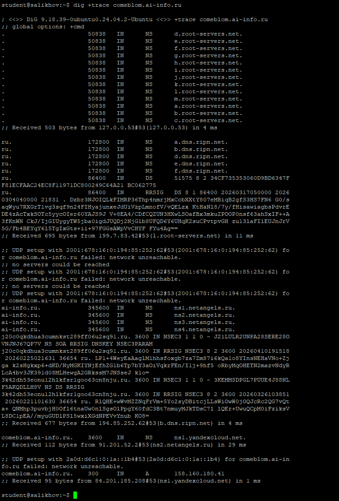
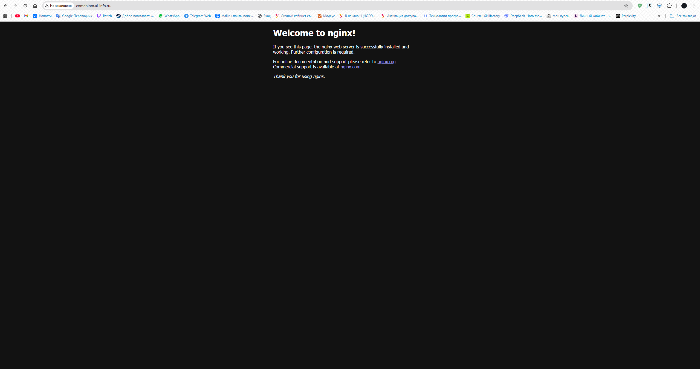

### Задание 1. Установка Nginx

Установлен веб-сервер Nginx через пакетный менеджер. Проверен статус службы — активен и работает.

---

### Задание 2. Страница по IP

Дефолтная страница Nginx успешно открывается по IP-адресу VPS в веб-браузере.

---

### Задание 3. curl

Выполнена проверка сайта с помощью утилиты `curl -v`. Результат:

- **Строка запроса**: `GET / HTTP/1.1`
- **Код ответа**: `200 OK`
- **Content-Type**: `text/html`

---

### Задание 4. Директория и права

Файл `/var/www/html/index.nginx-debian.html` найден как дефолтная страница. Владелец директории `/var/www/html/` изменён на пользователя `student`.

---

### Задание 5. Конфигурация Nginx

Анализ дефолтного конфигурационного файла `/etc/nginx/sites-available/default`:

| Директива | Значение | Назначение |
|-----------|----------|------------|
| `listen` | `80` | Указывает, что Nginx должен слушать входящие HTTP-запросы на порту 80 |
| `root` | `/var/www/html` | Определяет корневую директорию, из которой Nginx отдаёт файлы |
| `server_name` | `_` | Задаёт имя сервера; `_` означает «любое имя» (wildcard) |
| `index` | `index.html index.htm` | Указывает файлы, которые будут отдаваться по умолчанию при запросе каталога |

---

## Часть B. DNS

### Задание 6. DNS-зона

Создана DNS-зона `comeblom.ai-info.ru` в панели управления Yandex Cloud.

---

### Задание 7. A-запись

Добавлена A-запись, связывающая домен `comeblom.ai-info.ru` с IP-адресом VPS. TTL установлен в 300 секунд.

---

### Задание 8. ping

Доменное имя успешно резолвится в IP-адрес VPS, что подтверждается командой `ping`.

---

### Задание 9. dig

Выполнен запрос DNS-информации с помощью `dig`. Результат:

- **QUESTION SECTION**: запрос типа `A` для `comeblom.ai-info.ru`
- **ANSWER SECTION**: возвращён IP-адрес VPS и TTL = 300
- **SERVER**: локальный DNS-резолвер (обычно `127.0.0.53`)

---

### Задание 10. dig +trace

Выполнен трассировочный DNS-запрос. Этапы разрешения имени:

1. **Корень (`.`)**: получены NS-серверы для зоны `.ru`
2. **Зона `.ru`**: получены NS-серверы для `ai-info.ru`
3. **NS-серверы `ai-info.ru`**: получены NS-серверы для подзоны `comeblom.ai-info.ru`
4. **A-запись**: получен IP-адрес VPS

---

### Задание 11. Сайт по домену

Дефолтная страница Nginx успешно открывается по доменному имени `comeblom.ai-info.ru` в веб-браузере.

---
