# Лабораторная работа №4: Виртуальные хосты, статический сайт и исследование HTTP

**Студент:** [Салихов Вадим]    
**Дата выполнения:** 11.03.2026

---

## Часть A. Виртуальный хост основного сайта

### Задание 1. Директория проекта

Создана директория `/var/www/boardy` и переданы права пользователю `student`.

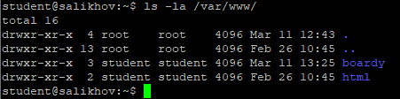

---

### Задание 2. Конфиг виртуального хоста

Создан конфигурационный файл для домена `comeblom.ai-info.ru`. Активирован через симлинк, дефолтный сайт отключён.

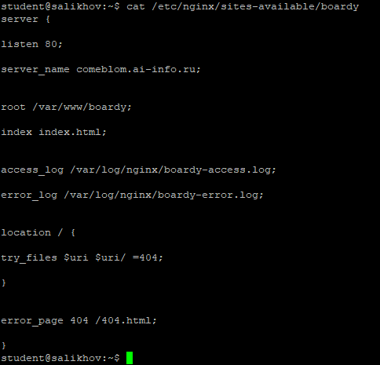

**Описание директив:**

- `server_name` — определяет доменное имя, для которого применяется данный блок сервера.
- `root` — указывает корневую директорию, из которой Nginx будет отдавать файлы.
- `access_log` — задаёт путь к файлу лога успешных запросов.
- `error_log` — задаёт путь к файлу лога ошибок.
- `try_files` — определяет порядок поиска файлов при обработке запроса (например, сначала файл, потом каталог, затем ошибка 404).
- `error_page` — настраивает кастомную страницу для указанного HTTP-кода ошибки (в данном случае — 404).

---

## Часть B. Страницы проекта

### Задание 3. Лендинг

Создана главная страница `index.html` с названием проекта Boardy, описанием и ссылкой на форму обратной связи.

---

### Задание 4. Форма обратной связи

Создана страница `feedback.html` с формой, содержащей поля «Имя» и «Сообщение», а также кнопку «Отправить». Форма отправляется методом POST на `/feedback`.

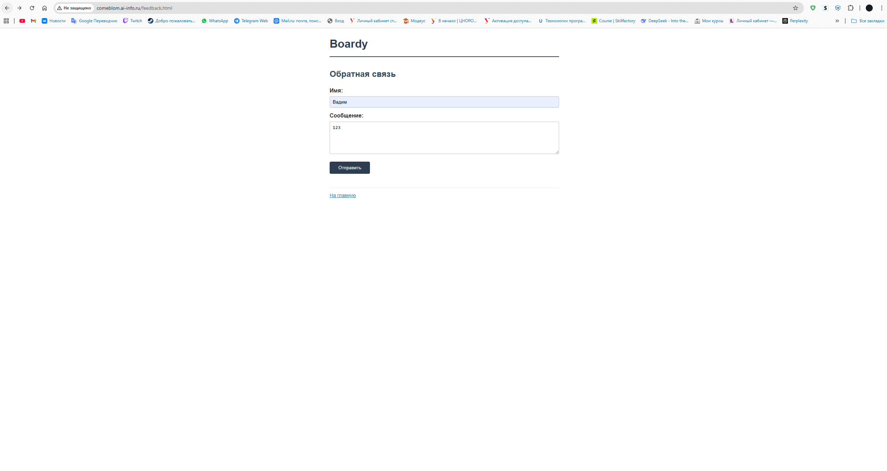

---

### Задание 5. Стили и 404

Созданы файлы:
- `css/style.css` — подключается на всех страницах
- `404.html` — кастомная страница ошибки 404

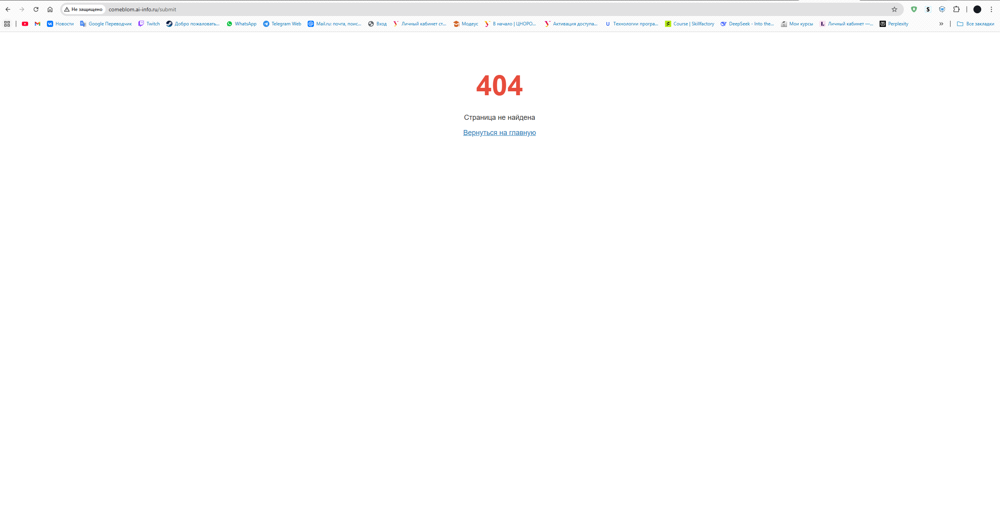

---

## Часть C. Второй виртуальный хост — API

### Задание 6. DNS-запись для поддомена

Создана A-запись `api.comeblom.ai-info.ru`, указывающая на IP VPS.

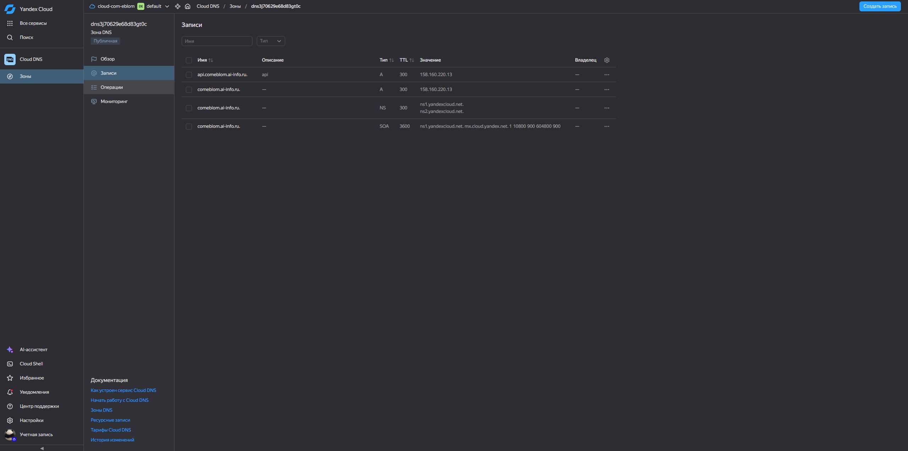

---

### Задание 7. Проверка DNS

Поддомен успешно резолвится в IP-адрес VPS как через локальный, так и через публичный DNS-резолвер.

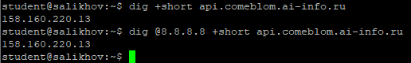

---

### Задание 8. Конфиг и заглушка API

Создана директория `/var/www/boardy-api` и заглушка `index.html` с текстом «Boardy API — Service: OK». Настроен отдельный виртуальный хост для поддомена.

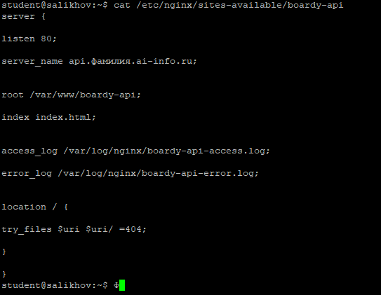

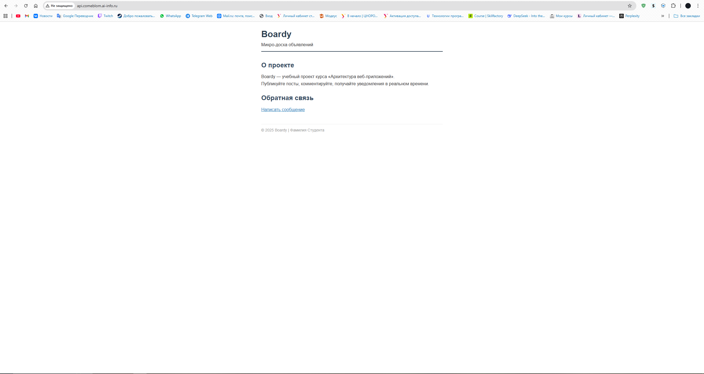

---

## Часть D. Исследование HTTP

### Задание 9. GET-запрос через curl -v

Выполнен запрос к основному сайту. Результат:

- **Стартовая строка запроса**: `GET / HTTP/1.1`
- **Заголовок Host**: `Host: comeblom.ai-info.ru`
- **Стартовая строка ответа**: `HTTP/1.1 200 OK`
- **Content-Type**: `text/html`
- **Content-Length**: `[число]`

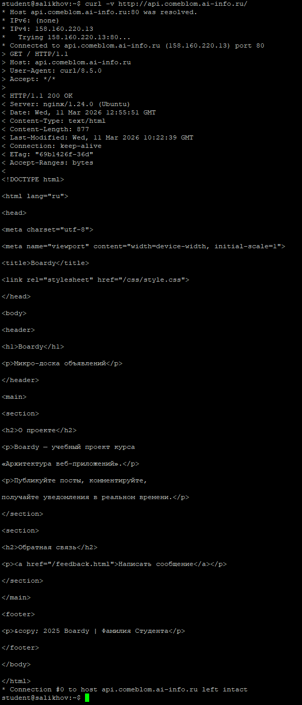

---

### Задание 10. Виртуальные хосты в действии

Выполнены три запроса по IP с разными заголовками `Host`:

1. `Host: comeblom.ai-info.ru` > возвращает главную страницу Boardy
2. `Host: api.comeblom.ai-info.ru` > возвращает заглушку API
3. `Host: unknown.ru` > возвращает ошибку 404 или дефолтную страницу

**Объяснение:**  
Nginx использует значение заголовка `Host` для выбора нужного виртуального хоста. Третий запрос не совпадает ни с одним `server_name`, поэтому Nginx возвращает ответ по умолчанию (обычно первый в списке или 404).

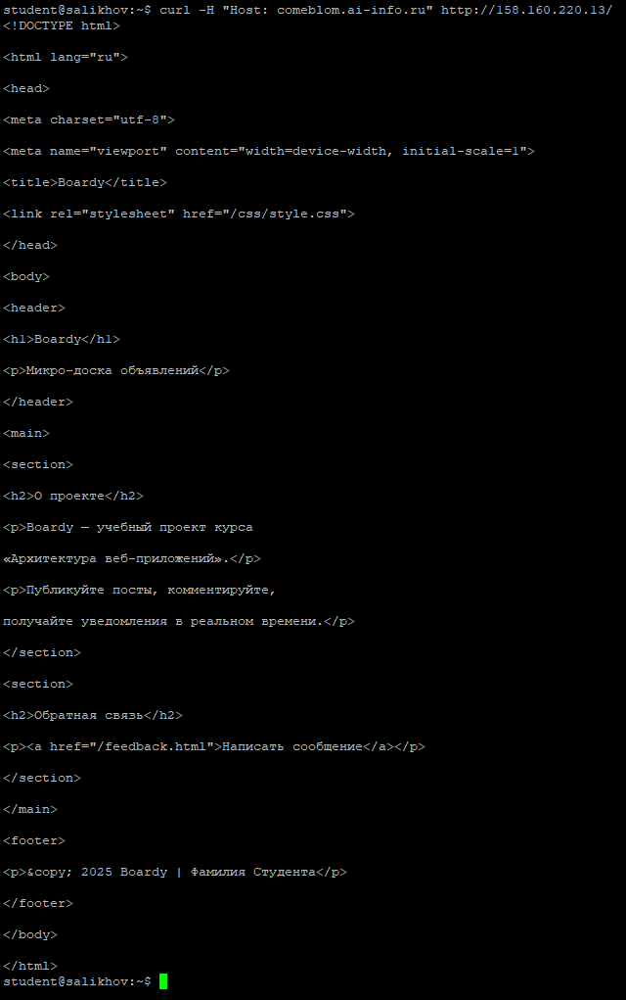
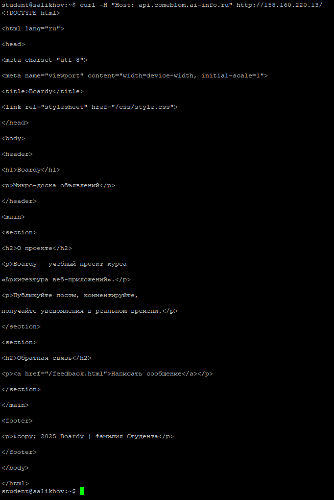
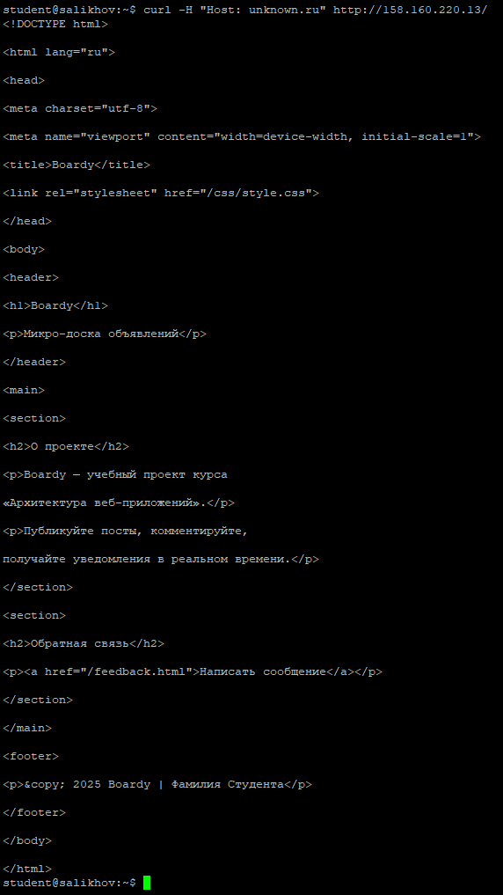

---

### Задание 11. POST-запрос

Отправка формы через `curl` завершилась с кодом **405 Method Not Allowed**.

- **Метод**: POST
- **Content-Type запроса**: `application/x-www-form-urlencoded`
- **Тело запроса**: `name=Ivanov&message=Hello`
- **Код ответа**: 405

**Почему 405?**  
Nginx по умолчанию не обрабатывает POST-запросы к статическим файлам. Маршрут `/feedback.html` не настроен, поэтому Nginx отклоняет запрос как недопустимый для статического контента.

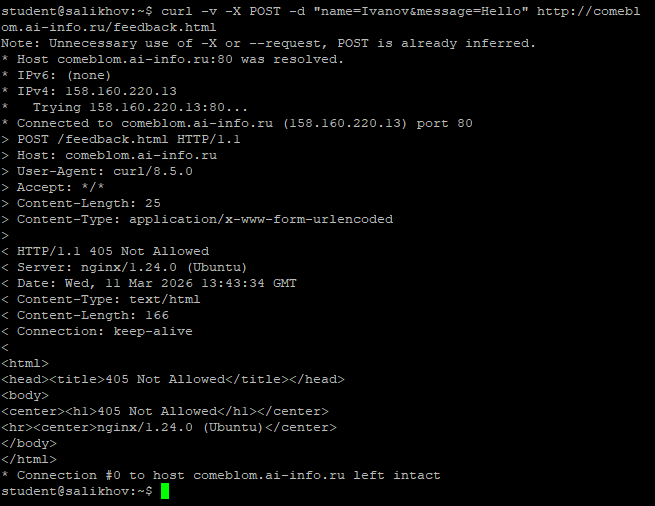

---

### Задание 12. HEAD-запрос

- **GET** возвращает полный ответ: заголовки + тело документа.
- **HEAD** возвращает **только заголовки**, без тела.

**Зачем нужен HEAD?**  
Чтобы проверить наличие ресурса, его метаданные (размер, тип, дата изменения) без передачи всего содержимого — экономит трафик и время.

---

## Часть E. Логи

### Задание 13. Раздельные логи

Запросы к основному сайту и API записываются в **отдельные файлы логов**, что подтверждает корректную настройку виртуальных хостов.

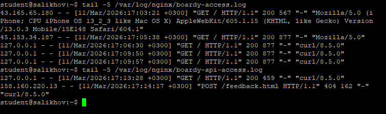

---

### Задание 14. Фильтрация логов

Пример строки из лога:

- **IP**: `192.168.1.100`
- **Метод**: `GET`
- **Путь**: `/`
- **Код ответа**: `200`
- **User-Agent**: `Mozilla/5.0 ...`

Статистика по кодам ответа показывает преобладание `200 OK` и единичные `404`.

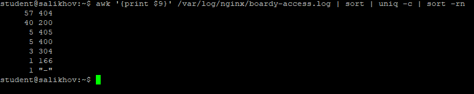

---
