# Практика 5: HTTPS для Boardy

**Студент:** Салихов Вадим   
**Дата выполнения:** 18.03.2026

---

## Часть A. HTTPS для основного сайта

### Задание 1. Установка certbot

Установлен пакет `certbot` и плагин для Nginx.

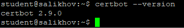

---

### Задание 2. Получение сертификата

Получен TLS-сертификат от Let’s Encrypt для домена `comeblom.ai-info.ru` с автоматической настройкой Nginx.

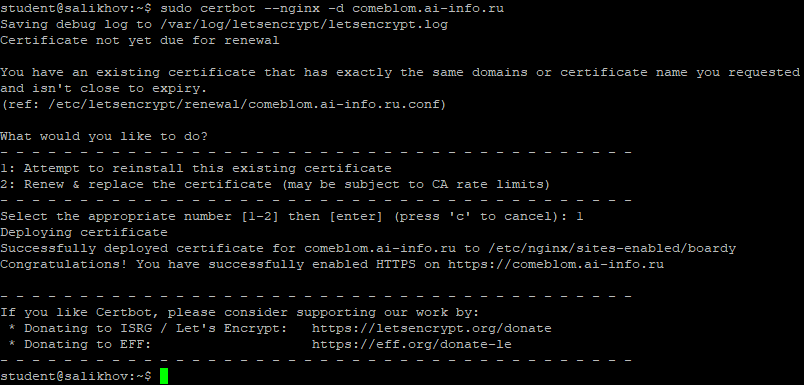

---

### Задание 3. Проверка в браузере

Сайт успешно открывается по HTTPS. В адресной строке отображается замок, подтверждающий безопасное соединение. Информация о сертификате доступна через клик по замку.

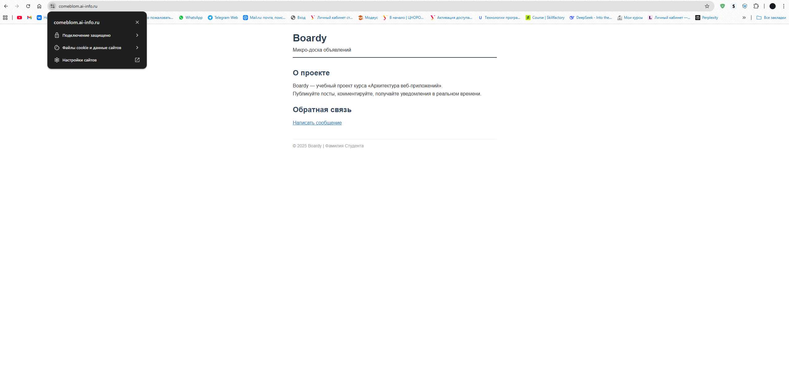

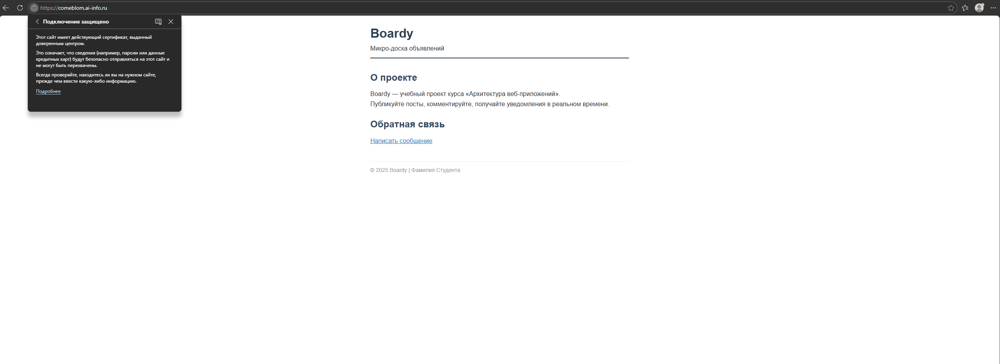

---

### Задание 4. Редирект

Выполнен запрос по HTTP. Сервер автоматически перенаправляет на HTTPS:

- **Код ответа**: `301 Moved Permanently`
- **Заголовок Location**: `https://comeblom.ai-info.ru/`

Это обеспечивает принудительный переход всех пользователей на защищённое соединение.

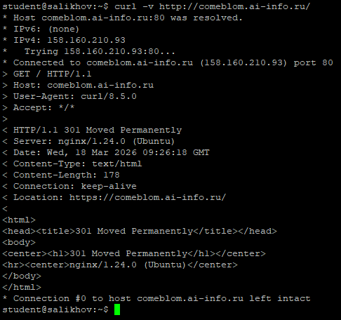

---

### Задание 5. Конфиг после certbot

Certbot автоматически добавил в конфигурацию Nginx следующие директивы:

- `listen 443 ssl;` — слушать HTTPS-запросы на порту 443
- `ssl_certificate /etc/letsencrypt/live/.../fullchain.pem;` — путь к цепочке сертификатов
- `ssl_certificate_key /etc/letsencrypt/live/.../privkey.pem;` — путь к приватному ключу

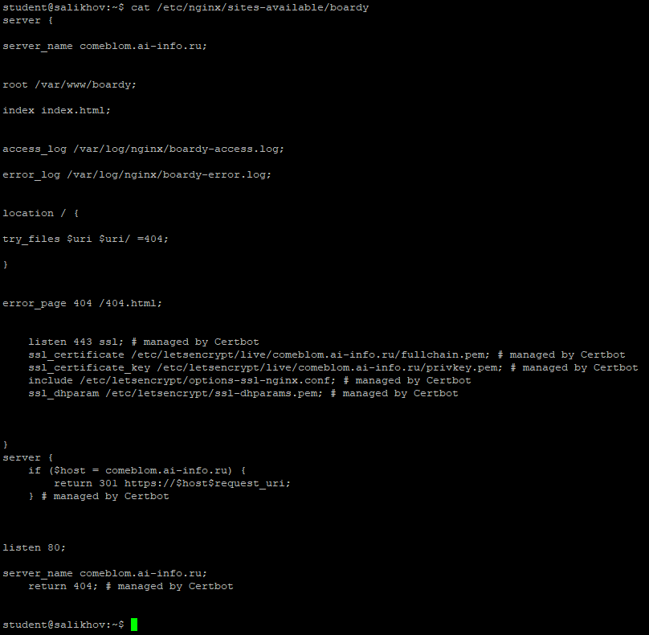

---

## Часть B. HTTPS для API-сервиса

### Задание 6. Сертификат для api-поддомена

Получен отдельный TLS-сертификат для поддомена `api.comeblom.ai-info.ru`.

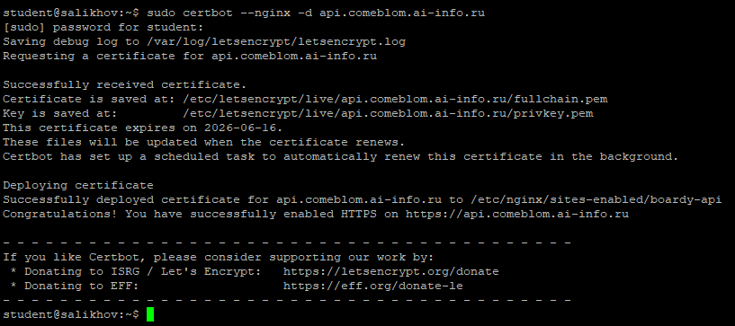

---

### Задание 7. Проверка обоих доменов

Оба домена (`comeblom.ai-info.ru` и `api.comeblom.ai-info.ru`) корректно отвечают по HTTPS с кодом `200 OK`.

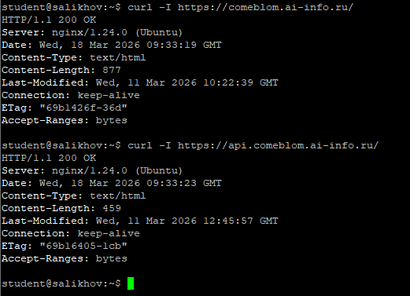

---

## Часть C. Разбор TLS

### Задание 8. TLS handshake

Анализ TLS-рукопожатия показал:

- **Версия TLS**: `TLSv1.3`
- **Алгоритм шифрования**: `TLS_AES_256_GCM_SHA384`
- **Subject**: `CN = comeblom.ai-info.ru`
- **Issuer**: `R11` (Let’s Encrypt)
- **Срок действия**: ~90 дней (стандарт Let’s Encrypt)

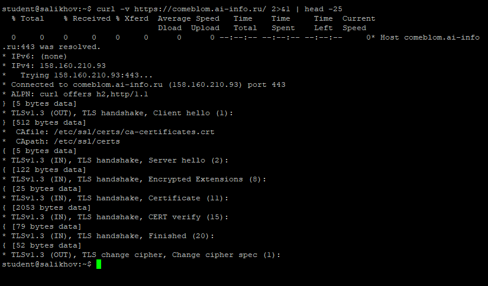

---

### Задание 9. Цепочка доверия

Цепочка доверия:
ISRG Root X1 (корневой CA)
└── R11 (промежуточный CA)
└── comeblom.ai-info.ru (сертификат сайта)

**Как проверяет браузер:**  
Браузер сверяет сертификат сайта с промежуточным CA, а промежуточный — с корневым, который уже доверенный и встроен в ОС/браузер. Если вся цепочка валидна и не истекла — соединение считается безопасным.

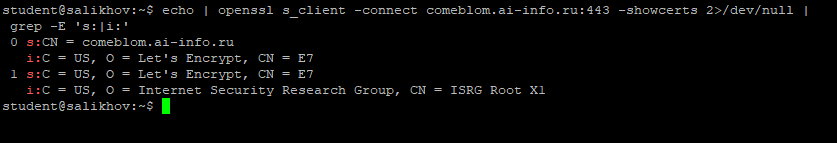

---

### Задание 10. Сравнение сертификатов

**Общее:**
- Выданы одним удостоверяющим центром (Let’s Encrypt R11)
- Одинаковый срок действия
- Используют одинаковые алгоритмы

**Отличия:**
- Разные **Subject**: `CN = comeblom.ai-info.ru` vs `CN = api.comeblom.ai-info.ru`
- Разные **SAN** (Subject Alternative Names)

Каждый сертификат привязан только к своему домену.

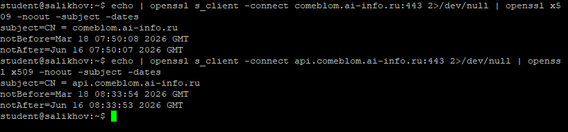

---

## Часть D. HSTS, кэширование, gzip

### Задание 11. HSTS

Добавлен заголовок:
nginx
add_header Strict-Transport-Security "max-age=31536000" always;

**Что такое HSTS?**  
HTTP Strict Transport Security — механизм, который заставляет браузер всегда использовать HTTPS при обращении к сайту в течение указанного времени (`max-age`).  
**От чего защищает?** От downgrade-атак и перехвата cookie при первом незащищённом запросе.

### Задание 12. Кэширование и gzip

Настроены:
- **Cache-Control** для статических файлов (`max-age=31536000`)
- **gzip** для сжатия HTML, CSS, JS

Проверка подтверждает наличие заголовков:
- `Cache-Control: max-age=31536000`
- `Content-Encoding: gzip`

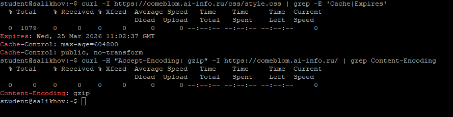

### Задание 13. Автообновление

Проверка автоматического обновления сертификатов прошла успешно. Certbot будет обновлять сертификаты каждые 60 дней.

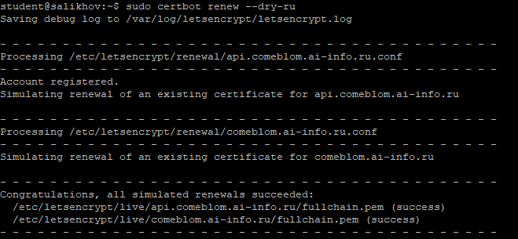
