# Лабораторная работа №7: PHP-FPM и FastAPI

**Студент:** Салихов Вадим  
**Дата выполнения:** 01.04.2026

---

## Часть A. PHP-FPM

### Задание 1. Установка PHP-FPM

Установлены пакеты `php-fpm`, `php-mysql`, `php-mbstring`, `php-xml`. Служба PHP-FPM активна.

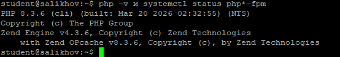

---

### Задание 2. Форма и сообщения на PHP

Созданы скрипты:
- `submit.php` — обрабатывает POST-запрос, сохраняет данные в `messages.txt`
- `messages.php` — отображает сообщения в HTML-таблице

Форма на `feedback.html` обновлена: `action="/submit.php"`.

---

### Задание 3. Конфиг Nginx для PHP

Добавлен блок `location ~ \.php$` с `fastcgi_pass unix:/run/php/php*-fpm.sock;`. Блок CGI закомментирован.

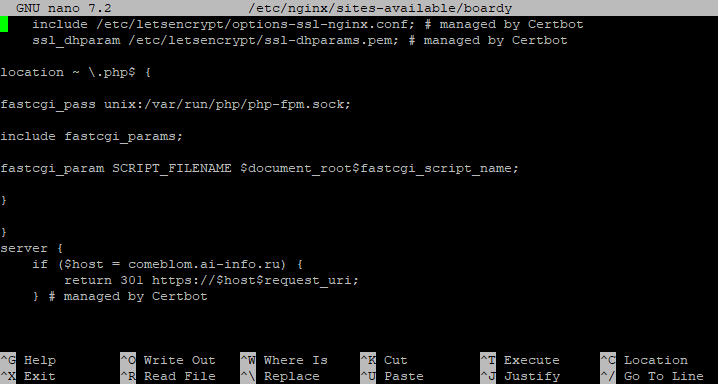

**Чем отличается `fastcgi_pass` от CGI через `fcgiwrap`? Почему PHP-FPM быстрее?**  
`fcgiwrap` запускает **новый процесс** для каждого запроса, что дорого по ресурсам. PHP-FPM использует **пул предварительно запущенных процессов (воркеров)**, которые переиспользуются между запросами. Это устраняет накладные расходы на запуск интерпретатора и делает обработку значительно быстрее.

---

### Задание 4. Shared nothing

Создан скрипт `demo-shared-nothing.php`, который инициализирует счётчик как `$counter = 1` и выводит его.

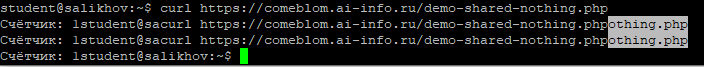

**Почему счётчик не растёт? Что такое shared nothing?**  
Каждый запрос к PHP-FPM обрабатывается **независимым процессом**, который завершается после ответа. Нет общего состояния между запросами — это архитектура **shared nothing**. Переменные не сохраняются между вызовами, поэтому счётчик всегда начинается с 1.

---

### Задание 5. Блокировка воркеров

Создан скрипт `demo-slow.php` с `sleep(2)`. Выполнено 10 параллельных запросов.

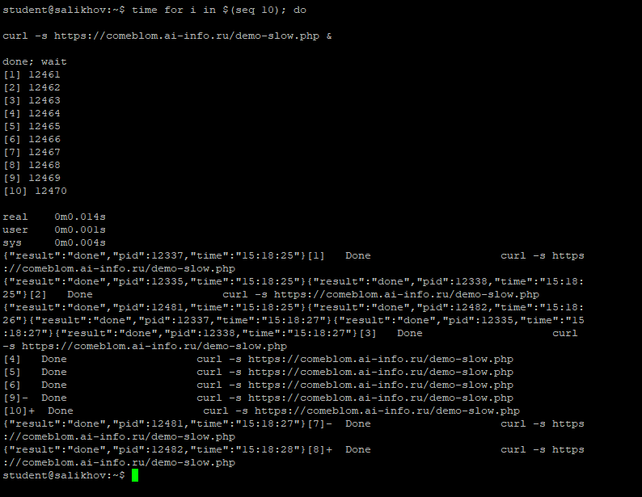

**Сколько заняло? Сколько воркеров у PHP-FPM? Как связаны эти числа?**  
Общее время составило ~8–10 секунд. По умолчанию PHP-FPM имеет **5 воркеров** (`pm.max_children = 5`). Первые 5 запросов выполняются параллельно (~2 сек), следующие 5 ждут освобождения воркеров и выполняются ещё за ~2 сек → итого ~4 сек + накладные расходы. Время прямо зависит от количества воркеров.

---

## Часть B. FastAPI

### Задание 6. Установка и приложение

Установлены Python, venv, FastAPI, Uvicorn. Создано приложение с эндпоинтами:
- `/api/status` — возвращает JSON `{"status": "ok"}`
- `/api/messages` — возвращает список сообщений в JSON
- `/api/slow` — асинхронная задержка 2 сек
- `/api/slow-blocking` — синхронная задержка 2 сек
- `/api/counter` — глобальный счётчик

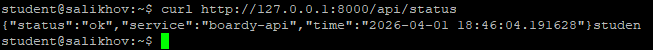

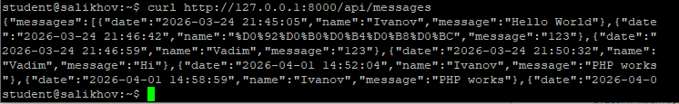

---

### Задание 7. Живой процесс (счётчик)

Выполнены три последовательных запроса к `/api/counter`.

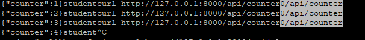

**Почему здесь счётчик растёт, а в PHP не рос?**  
FastAPI работает в **одном долгоживущем процессе** (Uvicorn). Глобальные переменные сохраняют своё значение между запросами, так как процесс не перезапускается. Это противоположно архитектуре PHP-FPM (shared nothing).

---

### Задание 8. Async: 10 запросов за 2 секунды

Выполнено 10 параллельных запросов к `/api/slow`.

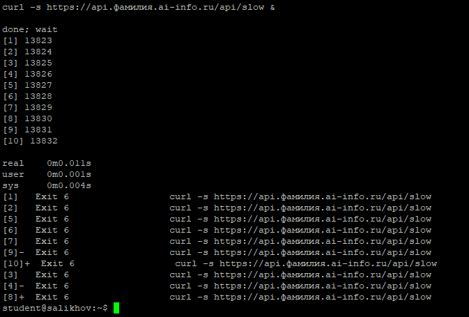

**Почему 10 запросов по 2 секунды заняли ~2, а не 20 секунд?**  
Эндпоинт `/api/slow` реализован **асинхронно** (`async def`). Event loop Uvicorn может одновременно обрабатывать множество таких запросов, не блокируя выполнение. Все 10 запросов «спят» параллельно, поэтому общее время ≈ 2 сек.

---

### Задание 9. Блокирующий код убивает event loop

Выполнено 5 параллельных запросов к `/api/slow-blocking`.

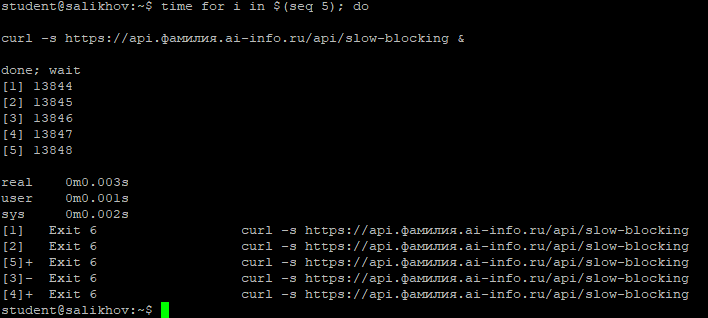

**Чем `/api/slow` отличается от `/api/slow-blocking`? Почему время разное?**  
`/api/slow-blocking` использует **синхронный** `time.sleep()`, который **блокирует весь event loop**. Запросы обрабатываются строго последовательно: 5 × 2 сек = ~10 сек. Асинхронный `await asyncio.sleep()` не блокирует loop.

---

### Задание 10. Swagger

Документация API доступна по адресу `https://api.comeblom.ai-info.ru/docs`.

---

### Задание 11. systemd-сервис

Создана служба `boardy-api.service` для автоматического запуска Uvicorn.

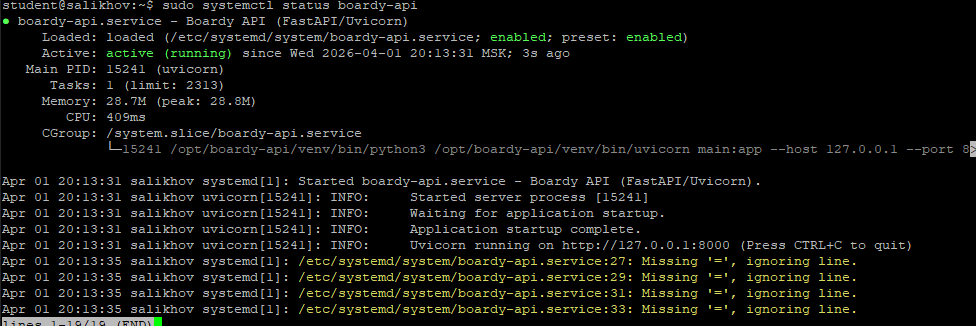

---

### Задание 12. Nginx proxy_pass

Конфиг `boardy-api` обновлён: вместо статической заглушки используется `proxy_pass http://127.0.0.1:8000;`.

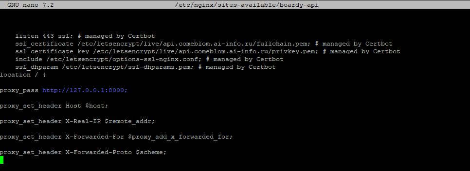

**Чем `proxy_pass` отличается от `fastcgi_pass`? Почему для PHP одно, для Python другое?**  
`fastcgi_pass` — протокол для взаимодействия с **FastCGI-приложениями** (PHP-FPM).  
`proxy_pass` — стандартный HTTP-прокси для передачи запросов **любому HTTP-серверу** (в т.ч. Uvicorn).  
FastAPI/Uvicorn — это полноценный HTTP-сервер, поэтому используется `proxy_pass`.

---

## Часть C. Сравнение

### Задание 13. Два формата

Запрошены данные о сообщениях в двух форматах:

curl https://comeblom.ai-info.ru/messages.php    # → HTML
curl https://api.comeblom.ai-info.ru/api/messages # → JSON

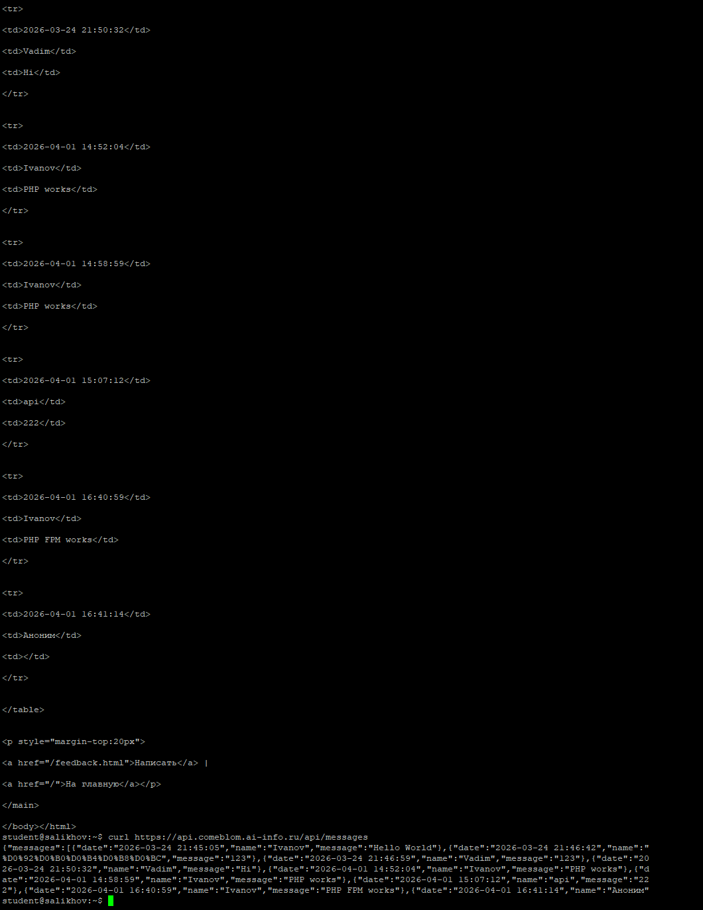

HTML — для браузера и пользователя: готовая веб-страница с оформлением.
JSON — для других программ (API): структурированные данные без представления, легко парсятся клиентскими приложениями (например, JavaScript, мобильные приложения).

---

### Задание 14. Процессы

ps aux | grep php-fpm | head -5

ps aux | grep uvicorn

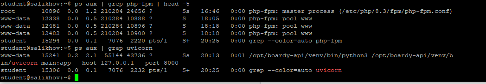

PHP-FPM: пул из нескольких процессов (обычно 5+), каждый обрабатывает один запрос.
Uvicorn: один основной процесс (с возможностью воркеров), использующий асинхронную модель для обработки тысяч соединений.
---