# Лабораторная работа №8: MySQL и интеграция с PHP/FastAPI

**Студент:** Салихов Вадим 
**Дата выполнения:** 07.04.2026

---

## Часть A. Установка и настройка MySQL

### Задание 1. Установка MySQL

Установлен сервер MySQL и выполнена базовая безопасная настройка.

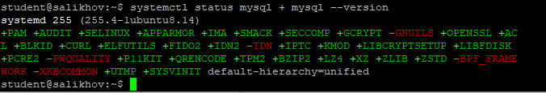

---

### Задание 2. База данных и пользователь

Создана база данных `boardy` с кодировкой `utf8mb4` и коллацией `utf8mb4_unicode_ci`. Создан пользователь `boardy` с полными правами на эту БД.

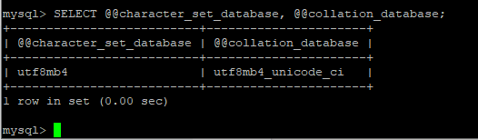

**Почему `utf8mb4`, а не `utf8`? Что такое collation и зачем `unicode_ci`?**  
В MySQL `utf8` — это урезанная реализация (макс. 3 байта), не поддерживающая эмодзи и некоторые символы. `utf8mb4` — настоящий UTF-8 (до 4 байт).  
**Collation** определяет правила сравнения строк. `utf8mb4_unicode_ci` обеспечивает корректное сравнение с учётом Unicode-нормализации, а `_ci` означает case-insensitive (регистронезависимое сравнение).

---

### Задание 3. phpMyAdmin

Установлен и настроен phpMyAdmin. Выполнен вход под пользователем `boardy`, видна база `boardy`.

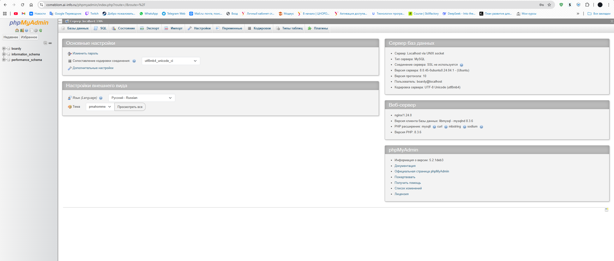

---

## Часть B. Таблицы и связи

### Задание 4. Три таблицы

Созданы таблицы:
- `users` (id, name, email)
- `posts` (id, title, body, author_id → users.id)
- `comments` (id, post_id → posts.id, author_id → users.id, content)

Настроены внешние ключи с `ON DELETE CASCADE`.

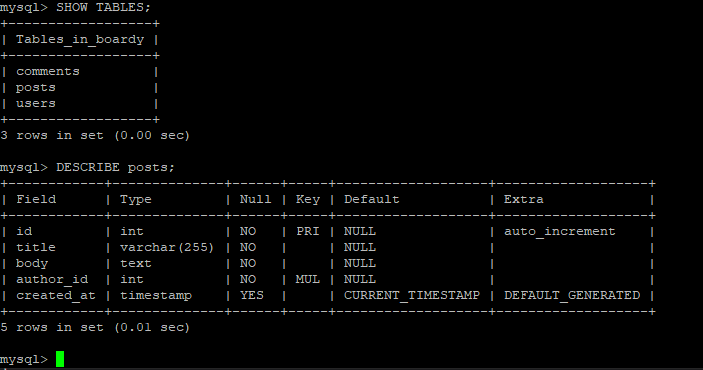

**Что такое FOREIGN KEY и ON DELETE CASCADE? Зачем? Какой движок используется и почему?**  
`FOREIGN KEY` — ограничение целостности, гарантирующее, что значение в столбце ссылается на существующую запись в другой таблице.  
`ON DELETE CASCADE` автоматически удаляет связанные записи при удалении родителя (например, посты и комментарии при удалении пользователя).  
Используется движок **InnoDB**, так как MyISAM не поддерживает внешние ключи.

---

### Задание 5. SQL-скрипт

Создан файл `src/boardy/sql/schema.sql` с командами `DROP TABLE IF EXISTS` и `CREATE TABLE`.

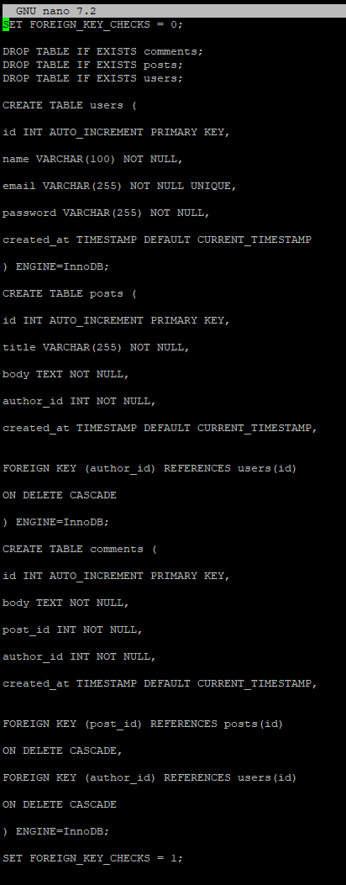

---

## Часть C. SQL — базовые операции

### Задание 6. INSERT

Добавлены тестовые данные: 3 пользователя, 5 постов, 3 комментария.

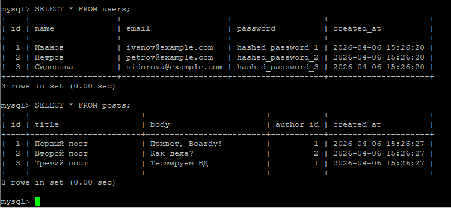

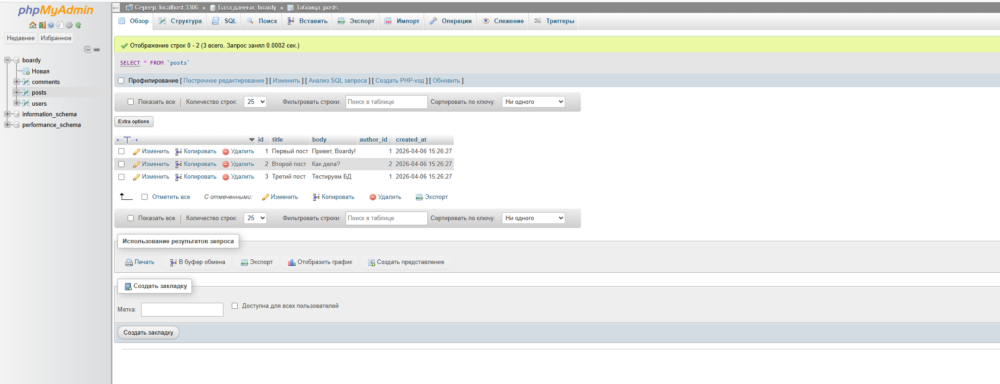

---

### Задание 7. SELECT + JOIN

Выполнен запрос с объединением таблиц `posts` и `users` для получения имени автора.

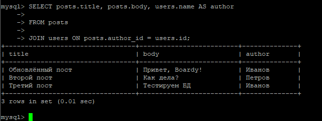

**Зачем JOIN? Как получить имя автора без него?**  
`JOIN` позволяет получать данные из нескольких связанных таблиц за один запрос. Без него пришлось бы сначала выбрать `author_id`, затем делать отдельный запрос к `users` для каждого поста — это медленно и неэффективно (N+1 проблема).

---

### Задание 8. Foreign Key — защита целостности

Попытка вставить пост с несуществующим `author_id = 999` завершилась ошибкой.

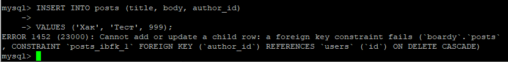

---

### Задание 9. CASCADE

Удалён один пользователь. Его посты и комментарии автоматически удалены благодаря `ON DELETE CASCADE`.

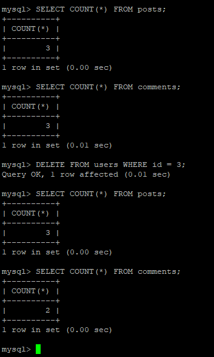

---

### Задание 10. SQL-инъекция

Выполнен запрос с инъекцией: `'' OR '1'='1'`, который вернул всех пользователей.

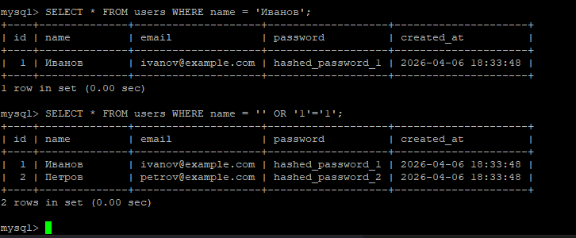

**Как работает SQL-инъекция? Как prepared statement защищает?**  
Инъекция возникает, когда пользовательский ввод напрямую вставляется в SQL-запрос, позволяя изменить его логику.  
**Prepared statement** разделяет запрос и данные: SQL-шаблон компилируется заранее, а данные передаются отдельно, исключая возможность изменения структуры запроса.

---

## Часть D. PHP + MySQL

### Задание 11. db.php

Создан файл `db.php` с подключением через PDO и указанием `charset=utf8mb4`.

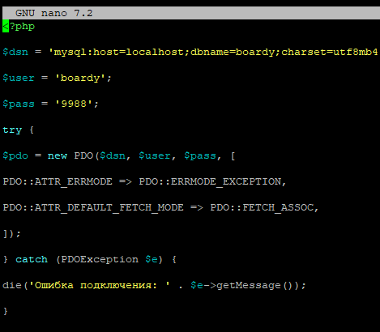

---

### Задание 12. submit.php через MySQL

Форма отправки переписана на использование `INSERT` с prepared statement.

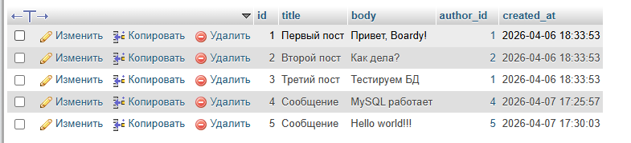

---

### Задание 13. messages.php через MySQL

Страница сообщений переписана на выборку данных из MySQL с использованием `JOIN`.

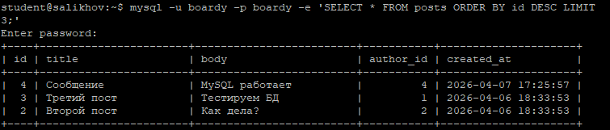

---

## Часть E. FastAPI + MySQL

### Задание 14. aiomysql

Установлен драйвер `aiomysql`. Эндпоинты `/api/messages` и `/api/users` обновлены для работы с MySQL.

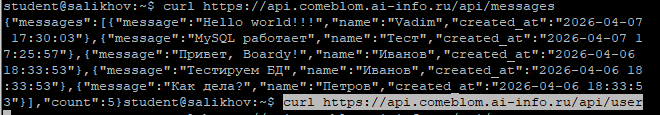

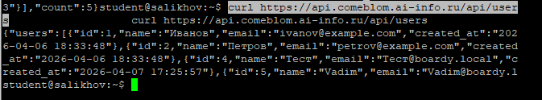

**Почему `aiomysql`, а не обычный `mysql-connector`? Что будет с event loop при синхронном драйвере?**  
`aiomysql` — это **асинхронный** драйвер, совместимый с `async/await`. Синхронный драйвер (например, `mysql-connector-python`) **блокирует весь event loop** на время выполнения запроса, делая сервер однопоточным и уничтожая преимущества асинхронности. Асинхронный драйвер позволяет обрабатывать другие запросы во время ожидания ответа от БД.