# Лабораторная работа №9: REST API и клиентские приложения

**Студент:** Салихов Вадим 
**Дата выполнения:** 15.04.2026

---

## Часть A. REST API

### Задание 1. Структура проекта

Созданы файлы `database.py` и `routers/comments.py`. Проект организован по модульному принципу.

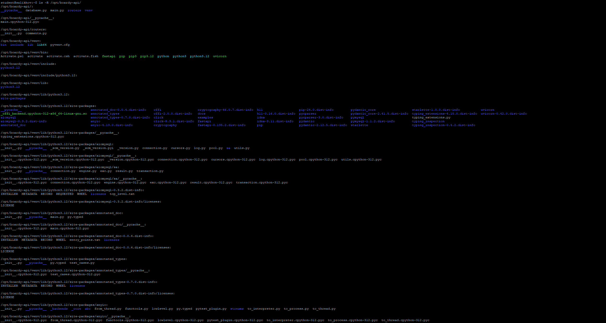

---

### Задание 2. GET — список комментариев

Выполнен запрос к эндпоинту получения комментариев к посту.

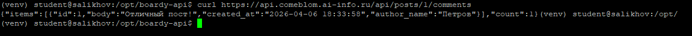

**Какой SQL-запрос выполняет этот эндпоинт? Зачем JOIN?**  
sql
SELECT comments.id, comments.body, comments.created_at, users.name AS author_name
FROM comments
JOIN users ON comments.author_id = users.id
WHERE comments.post_id = 1;

---

### Задание 3. POST — создать комментарий

Отправлен новый комментарий через POST-запрос.

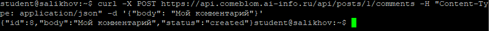

Код 201 Created используется при успешном создании нового ресурса (в отличие от 200 OK для обычного чтения).

---

### Задание 4. PUT — редактировать

Выполнен запрос на обновление существующего комментария.

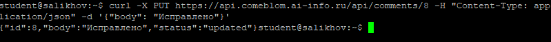

POST создаёт новый ресурс в коллекции (/posts/1/comments).
PUT обновляет существующий ресурс по его уникальному идентификатору (/comments/{id}). Это соответствует REST-конвенциям.

---

### Задание 5. DELETE — удалить

Удалён комментарий через DELETE-запрос.

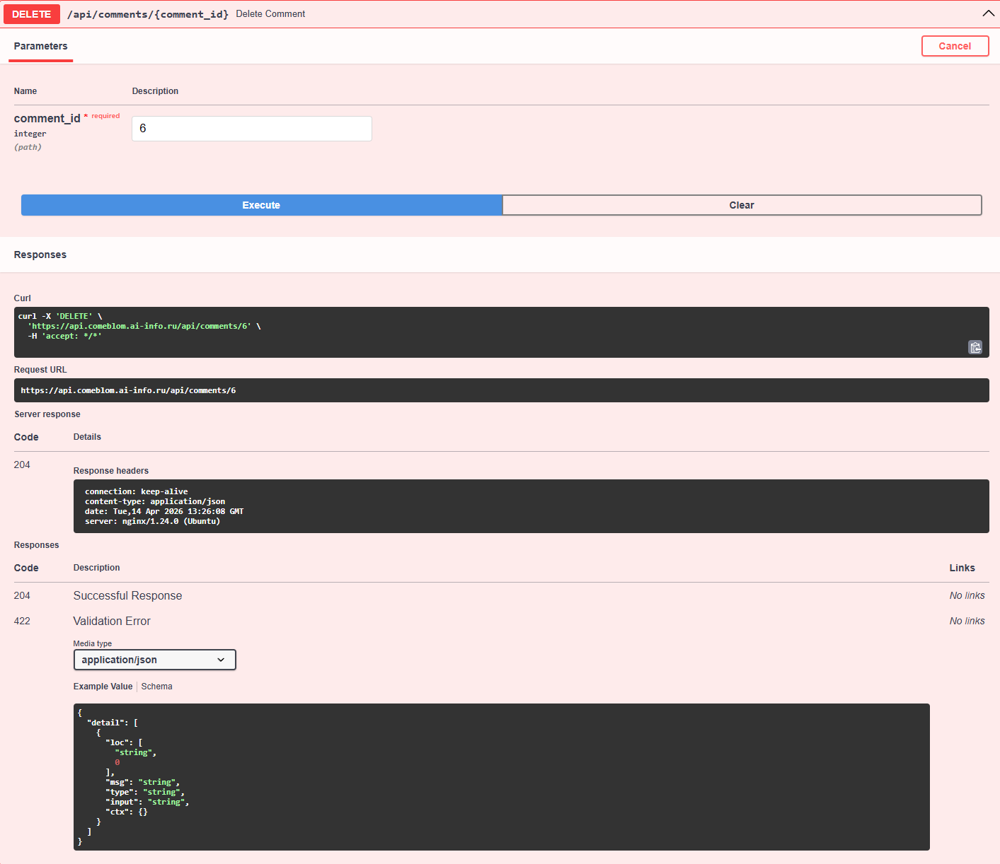

Перечислите 4 HTTP-глагола. Какой код ответа у каждого и почему?
-GET → 200 OK 
-POST → 201 Created 
-PUT → 200 OK или 204 No Content 
-DELETE → 204 No Content 

---

### Задание 6. Ошибки

Получены ошибки валидации и отсутствующего ресурса.

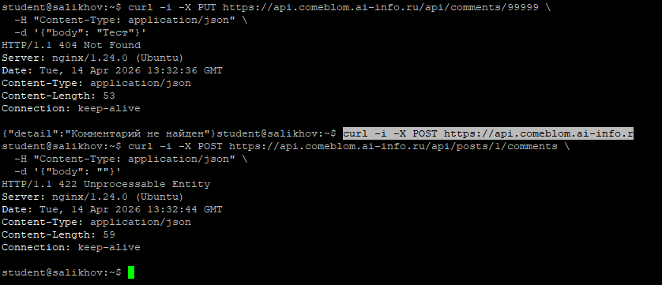

404 Not Found — запрашиваемый ресурс (например, комментарий с ID=999) не существует.
422 Unprocessable Entity — запрос синтаксически корректен, но семантически невалиден.

---

### Задание 7. Swagger

Интерфейс Swagger использован для тестирования API.

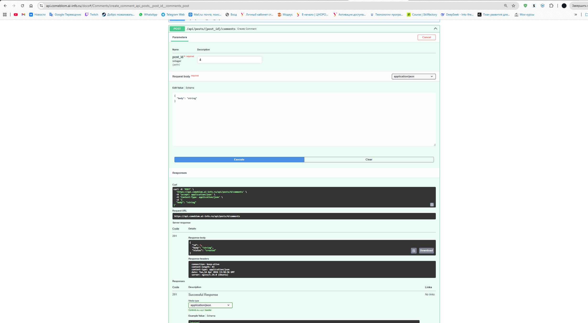

---

### Задание 8. Vanilla JS — демо

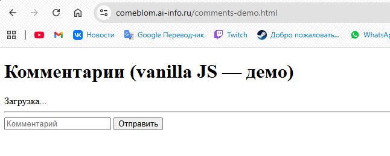

Функция esc() экранирует HTML-спецсимволы (<, >, & и др.), преобразуя их в сущности (&lt;, &gt; и т.д.). Без неё возможна XSS-уязвимость: пользовательский ввод будет интерпретирован как HTML/JS.

---

### Задание 9. React — полный CRUD

Реализован полнофункциональный клиент на React с поддержкой всех операций.

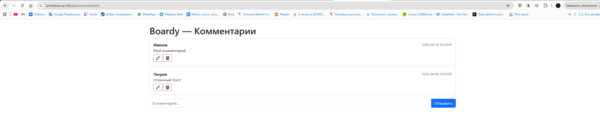
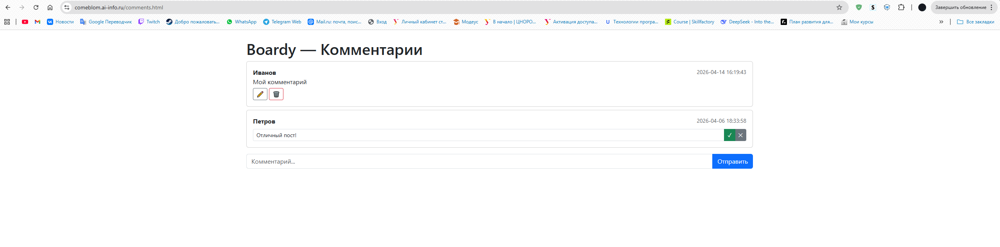
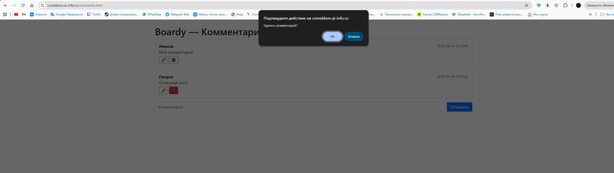

---

### Задание 10. Сравнение кода

-Где хранится состояние?
1 Vanilla JS: в глобальных переменных или DOM.
2 React: в состоянии компонентов (useState).
— Как обновляется список после добавления?
1 Vanilla JS: вручную пересоздаётся HTML-разметка и заменяется в DOM.
2 React: автоматически перерисовывает компонент при изменении состояния.
— Как реализовано редактирование?
1 Vanilla JS: замена элемента на форму с помощью innerHTML.
2 React: условный рендеринг (отображение либо текста, либо формы в зависимости от состояния).
— Как защищаемся от XSS?
1 Vanilla JS: вручную через функцию esc().
2 React: автоматически — JSX по умолчанию экранирует все значения.

---

### Задание 11. DevTools → Network

Проанализированы сетевые запросы в браузере.

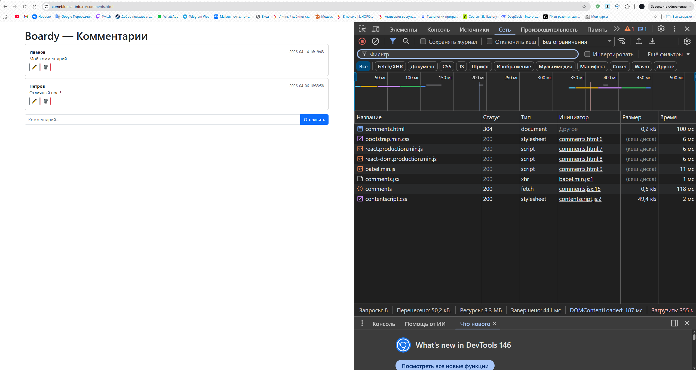

Запросов несколько: HTML, CSS, JS, favicon.
Запрос к API — это единственный XHR/Fetch-запрос к https://api.comeblom.ai-info.ru/api/posts/...

---

### Задание 12. View Source

Сравнены исходные коды SSR и CSR страниц.

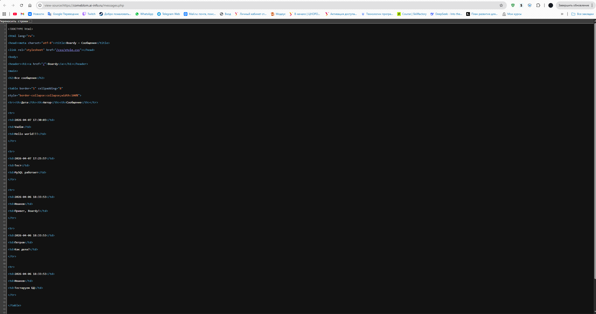
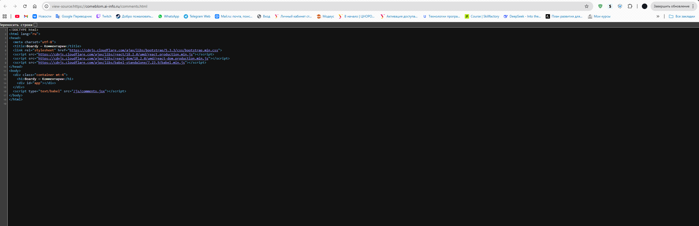

---

### Задание 13. XSS

Проверена защита от XSS-атак.

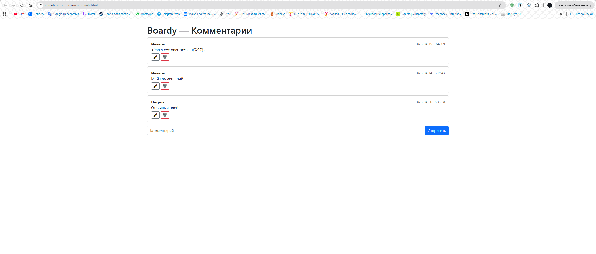

Vanilla JS: защита зависит от разработчика (функция esc()). Если забыть её вызвать — уязвимость.
React: защита встроена на уровне JSX — все значения автоматически экранируются.
React надёжнее, так как защита работает «из коробки» и не зависит от человеческого фактора.

---

### Задание 14. Итоговая таблица

| Критерий                     | SSR (PHP)               | vanilla JS              | React                   |
|------------------------------|-------------------------|-------------------------|-------------------------|
| **Кто рендерит HTML?**       | Сервер                  | Браузер (JS)            | Браузер (JS)            |
| **Формат ответа сервера**    | Готовый HTML            | JSON                    | JSON                    |
| **View Source: данныевидны?**| Да                      | Нет                     | Нет                     |
| **Перезагрузка при отправке**| Да                      | Нет                     | Нет                     |
| **Защита от XSS**            | Ручная                  | Ручная (esc())          | Автоматическая (JSX)    |
| **Сложность кода**           | Простая                 | Средняя                 | Высокая                 |